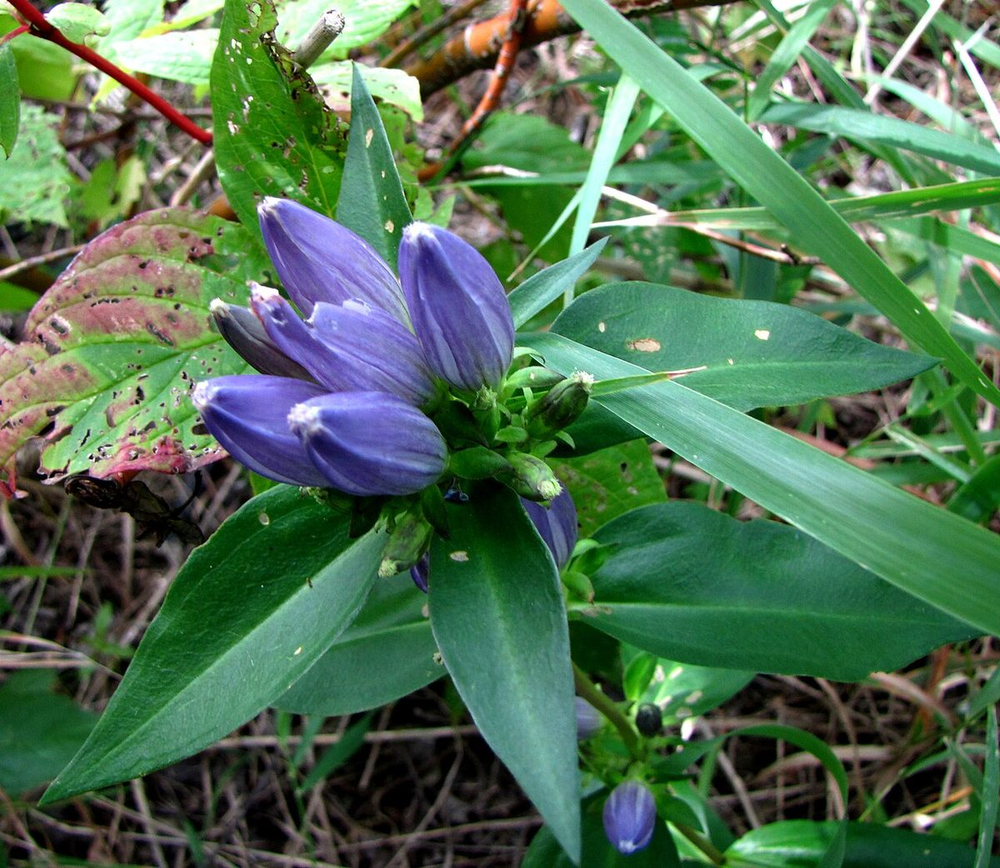
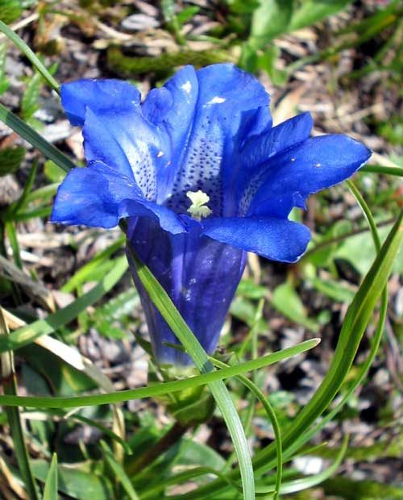

# Closed Gentian

*Gentiana andrewsii*

Gentiana andrewsii, the bottle gentian, closed gentian, or closed bottle gentian, is an herbaceous species of flowering plant in the gentian family Gentianaceae. Gentiana andrewsii is native to northeastern North America, from the Dakotas to the East Coast and through eastern Canada.
It shares the common name "bottle gentian" with several other species.

## Quick Facts

| | |
|---|---|
| **Scientific name** | *Gentiana andrewsii* |
| **Family** | Gentianaceae |
| **Height** | 1-2 ft |
| **Bloom time** | Aug-Sep |
| **Sun** | Full sun to part shade |
| **Moisture** | Mesic to wet |
| **Soil** | Loam |
| **Wildlife value** | Flowers never open - only bumble bees are strong enough to force them |

## Mentioned In

- [Ecological Restoration](../chapters/12-ecological-restoration/index.md)

## Image Credits

- D. Gordon E. Robertson (CC BY-SA 3.0)
- Unknown (CC BY-SA 3.0)

## Learn More

- [Wikipedia: Gentiana andrewsii](https://en.wikipedia.org/wiki/Gentiana_andrewsii)
