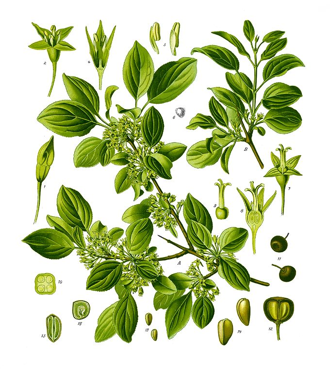

# Common Buckthorn

*Rhamnus cathartica*

Rhamnus cathartica, the European buckthorn, common buckthorn, purging buckthorn, or just buckthorn, is a species of small tree in the flowering plant family Rhamnaceae. It is native to Europe, northwest Africa and western Asia, from the central British Isles south to Morocco, and east to Kyrgyzstan. It was introduced to North America as an ornamental shrub in the early 19th century or perhaps before, and is now naturalized in the northern half of the continent, and is classified as an invasive plant in several US states and in Ontario and Québec, Canada.

## Quick Facts

| | |
|---|---|
| **Scientific name** | *Rhamnus cathartica* |
| **Family** | — |
| **Height** | — |
| **Bloom time** | — |
| **Sun** | — |
| **Moisture** | — |
| **Soil** | — |
| **Wildlife value** | — |

## Mentioned In

- [Invasive Species Id](../chapters/08-invasive-species-id/index.md)
- [Invasive Species Removal](../chapters/09-invasive-species-removal/index.md)

## Image Credits

- MartinFields (CC BY-SA 3.0)
- Köhler, F. E. (Franz Eugen) (Public domain)

## Learn More

- [Wikipedia: Rhamnus cathartica](https://en.wikipedia.org/wiki/Rhamnus_cathartica)
