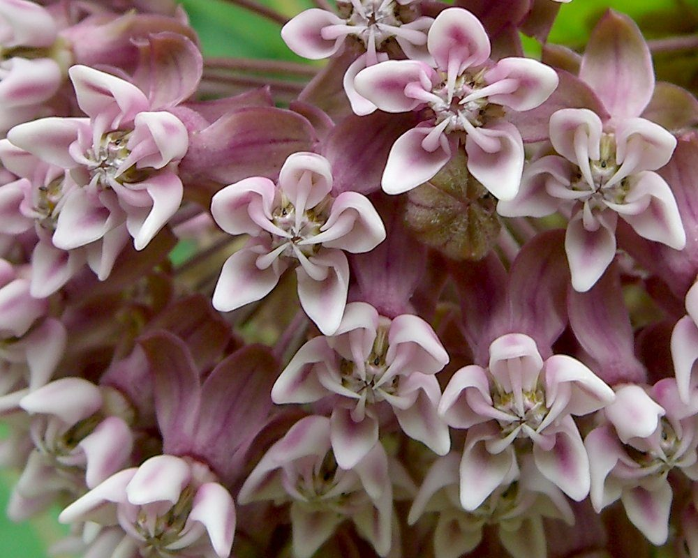
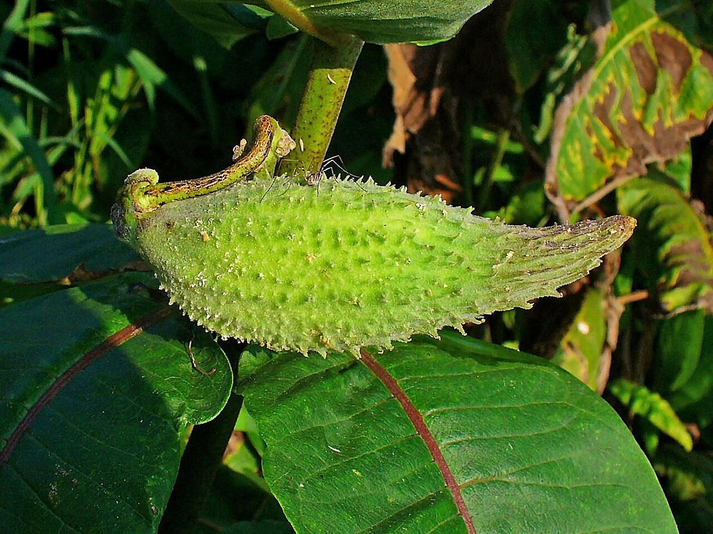

# Common Milkweed

*Asclepias syriaca*

Asclepias syriaca, commonly called common milkweed, butterfly flower, silkweed, silky swallow-wort, and Virginia silkweed, is a species of flowering plant. It is native to southern Canada and much of the United States east of the Rocky Mountains, excluding the drier parts of the prairies. It is in the genus Asclepias, the milkweeds.

## Quick Facts

| | |
|---|---|
| **Scientific name** | *Asclepias syriaca* |
| **Family** | — |
| **Height** | — |
| **Bloom time** | — |
| **Sun** | — |
| **Moisture** | — |
| **Soil** | — |
| **Wildlife value** | — |

## Mentioned In

- [Pollinators Wildlife](../chapters/06-pollinators-wildlife/index.md)

## Image Credits

- Jason Hollinger (CC BY 2.0)
- H. Zell (CC BY-SA 3.0)

## Learn More

- [Wikipedia: Asclepias syriaca](https://en.wikipedia.org/wiki/Asclepias_syriaca)
