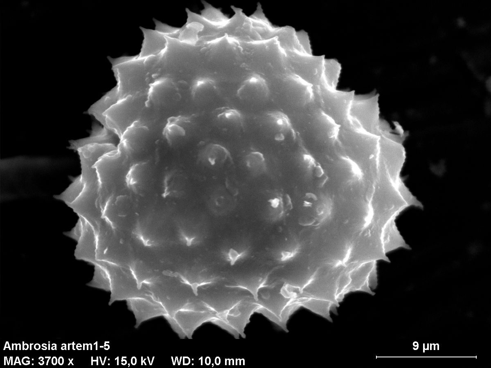
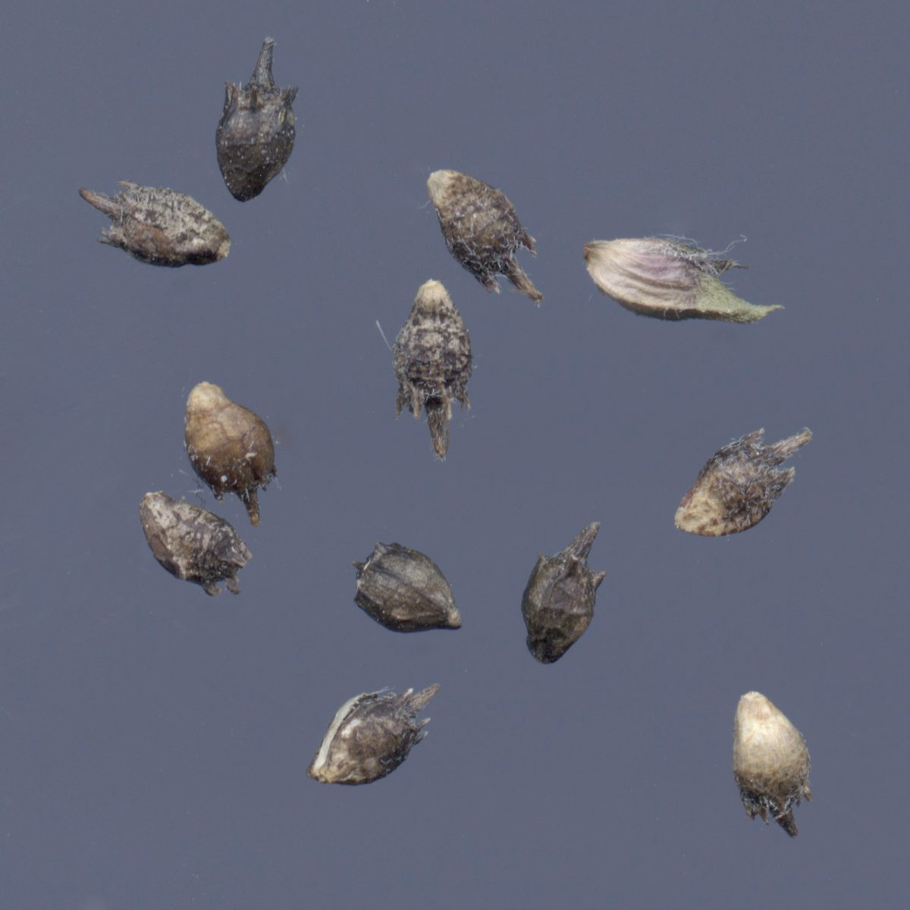

# Common Ragweed

*Ambrosia artemisiifolia*

Ambrosia artemisiifolia, with the common names common ragweed, annual ragweed, and low ragweed, is a species of the genus Ambrosia native to regions of the Americas.

## Quick Facts

| | |
|---|---|
| **Scientific name** | *Ambrosia artemisiifolia* |
| **Family** | — |
| **Height** | — |
| **Bloom time** | — |
| **Sun** | — |
| **Moisture** | — |
| **Soil** | — |
| **Wildlife value** | — |

## Mentioned In

- [Prairie Plants Grasslands](../chapters/03-prairie-plants-grasslands/index.md)

## Image Credits

- Marie Majaura (CC BY-SA 3.0)
- Gerhard Doerries (CC BY 3.0)

## Learn More

- [Wikipedia: Ambrosia artemisiifolia](https://en.wikipedia.org/wiki/Ambrosia_artemisiifolia)
