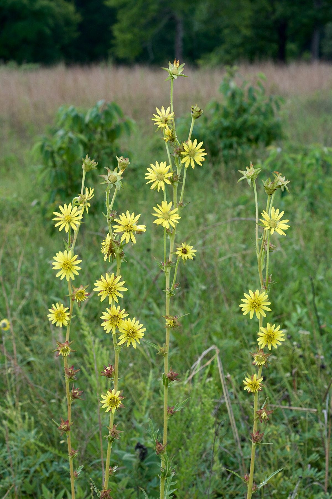

# Compass Plant

*Silphium laciniatum*

Silphium laciniatum is a species of flowering plant in the family Asteraceae known commonly as compassplant or compass plant. It is native to North America, where it occurs in Ontario in Canada and the eastern and central United States as far west as New Mexico. Other common names include prairie compass plant, pilotweed, polarplant, gum weed, cut-leaf silphium, and turpentine plant.

## Quick Facts

| | |
|---|---|
| **Scientific name** | *Silphium laciniatum* |
| **Family** | — |
| **Height** | — |
| **Bloom time** | — |
| **Sun** | — |
| **Moisture** | — |
| **Soil** | — |
| **Wildlife value** | — |

## Mentioned In

- [Prairie Plants Grasslands](../chapters/03-prairie-plants-grasslands/index.md)
- [Garden Design Native Plants](../chapters/10-garden-design-native-plants/index.md)
- [Ecological Restoration](../chapters/12-ecological-restoration/index.md)

## Image Credits

- Frank Mayfield (CC BY-SA 2.0)
- Eric Hunt (CC BY-SA 4.0)

## Learn More

- [Wikipedia: Silphium laciniatum](https://en.wikipedia.org/wiki/Silphium_laciniatum)
