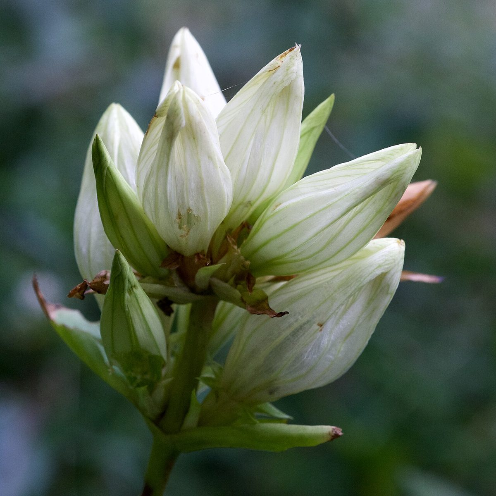

# Cream Gentian

*Gentiana alba*

Gentiana alba (called plain, pale, white, cream, or yellow gentian) is a herbaceous species of flowering plant in the Gentian family Gentianaceae, producing yellowish-white colored flowers from thick white taproots.  It is native to North America from Manitoba through Ontario in the north, south to Oklahoma, Arkansas and North Carolina, and it is listed as rare, endangered, threatened or extirpated in parts of this range.
This species resembles bottle gentian (Gentiana andrewsii), which has blue flowers and a less upright habit, and shares much of the same range.

## Quick Facts

| | |
|---|---|
| **Scientific name** | *Gentiana alba* |
| **Family** | — |
| **Height** | — |
| **Bloom time** | — |
| **Sun** | — |
| **Moisture** | — |
| **Soil** | — |
| **Wildlife value** | — |

## Mentioned In

- [Pollinators Wildlife](../chapters/06-pollinators-wildlife/index.md)

## Image Credits

- Unknown (CC BY-SA 3.0)
- Eric Hunt (CC BY-SA 4.0)

## Learn More

- [Wikipedia: Gentiana alba](https://en.wikipedia.org/wiki/Gentiana_alba)
