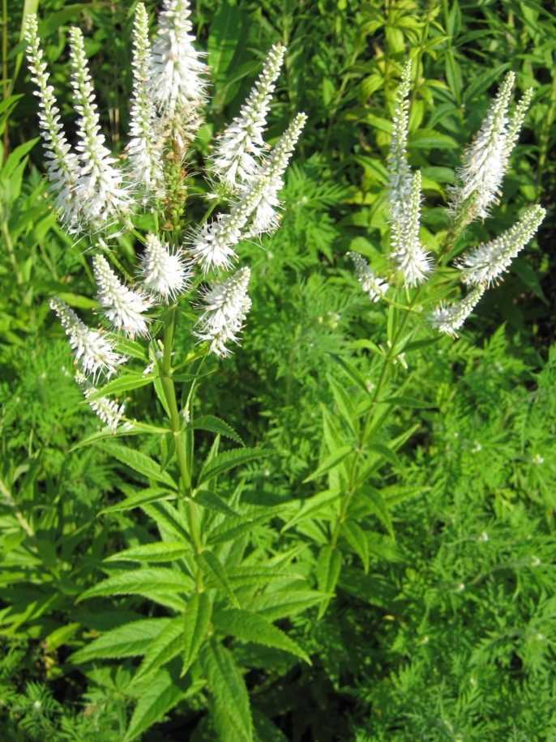

# Culver's Root

*Veronicastrum virginicum*

Veronicastrum virginicum, or Culver's root, is a species of flowering plant in the plantain family, Plantaginaceae. It is native to the eastern United States and south-eastern Canada. Growing to 200 cm (79 in) tall by 45 cm (18 in) broad, it is an erect herbaceous perennial with slender racemes of white or occasionally pink or purple flowers in summer.

## Quick Facts

| | |
|---|---|
| **Scientific name** | *Veronicastrum virginicum* |
| **Family** | — |
| **Height** | — |
| **Bloom time** | — |
| **Sun** | — |
| **Moisture** | — |
| **Soil** | — |
| **Wildlife value** | — |

## Mentioned In

- [Garden Design Native Plants](../chapters/10-garden-design-native-plants/index.md)
- [Ecological Restoration](../chapters/12-ecological-restoration/index.md)

## Image Credits

- ThatLexingtonKyGuy (CC BY-SA 4.0)
- Crazytwoknobs (CC BY 3.0)

## Learn More

- [Wikipedia: Veronicastrum virginicum](https://en.wikipedia.org/wiki/Veronicastrum_virginicum)
