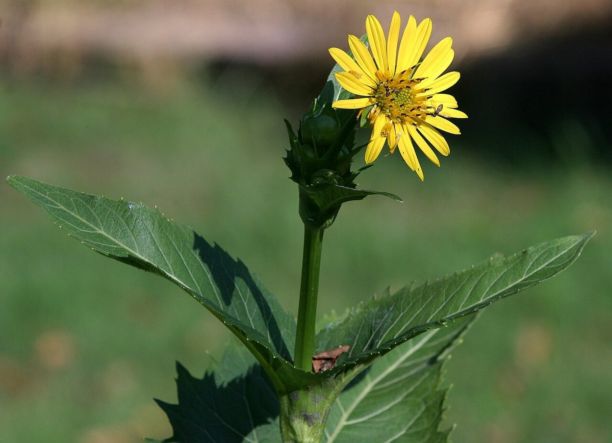
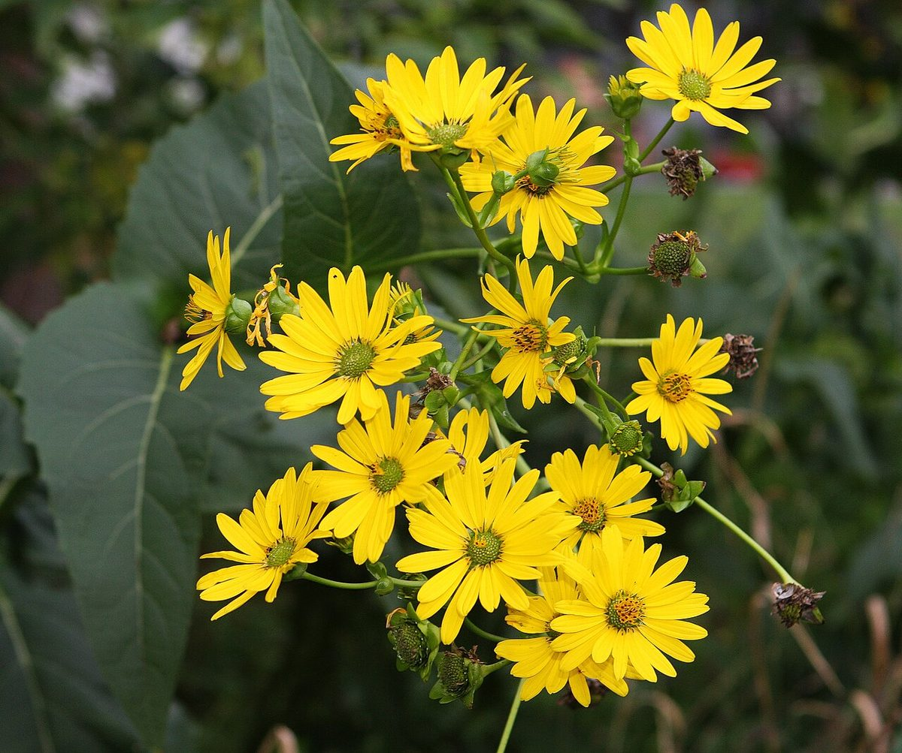

# Cup Plant

*Silphium perfoliatum*

Silphium perfoliatum, the cup plant or cup-plant, is a species of  flowering plant in the family Asteraceae, native to eastern and central North America. It is an erect herbaceous perennial with triangular toothed leaves, and daisy-like yellow composite flower heads in summer.
The specific epithet perfoliatum means "through the leaf."
There are two varieties:

Silphium perfoliatum var.

## Quick Facts

| | |
|---|---|
| **Scientific name** | *Silphium perfoliatum* |
| **Family** | — |
| **Height** | — |
| **Bloom time** | — |
| **Sun** | — |
| **Moisture** | — |
| **Soil** | — |
| **Wildlife value** | — |

## Mentioned In

- [Pollinators Wildlife](../chapters/06-pollinators-wildlife/index.md)
- [Garden Design Native Plants](../chapters/10-garden-design-native-plants/index.md)

## Image Credits

- Unknown (Public domain)
- No machine-readable author provided. Hardyplants assumed (based on copyright claims). (Public domain)

## Learn More

- [Wikipedia: Silphium perfoliatum](https://en.wikipedia.org/wiki/Silphium_perfoliatum)
