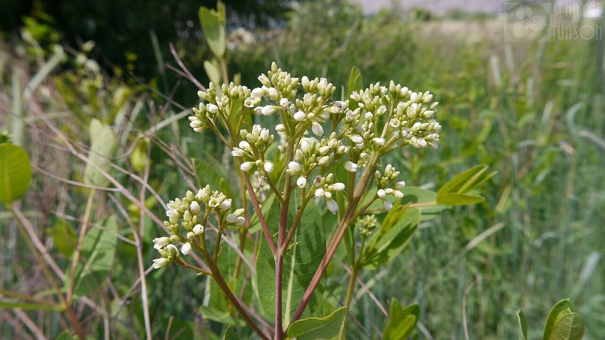

# Dogbane

*Apocynum cannabinum*

Apocynum cannabinum (dogbane, amy root, hemp dogbane, prairie dogbane, Indian hemp, hemp dogsbane, rheumatism root, dogsbane, or wild cotton) is a perennial herbaceous plant that grows throughout much of North America—in the southern half of Canada and throughout the United States. It is poisonous to humans, dogs, cats, and horses. All parts of the plant contain toxic cardiac glycosides that can cause potentially fatal cardiac arrhythmias if ingested.

## Quick Facts

| | |
|---|---|
| **Scientific name** | *Apocynum cannabinum* |
| **Family** | — |
| **Height** | — |
| **Bloom time** | — |
| **Sun** | — |
| **Moisture** | — |
| **Soil** | — |
| **Wildlife value** | — |

## Mentioned In

- [Cultural Indigenous Uses](../chapters/13-cultural-indigenous-uses/index.md)

## Image Credits

- U. S. Department of Agriculture (Public domain)
- Thayne Tuason (CC BY 4.0)

## Learn More

- [Wikipedia: Apocynum cannabinum](https://en.wikipedia.org/wiki/Apocynum_cannabinum)
