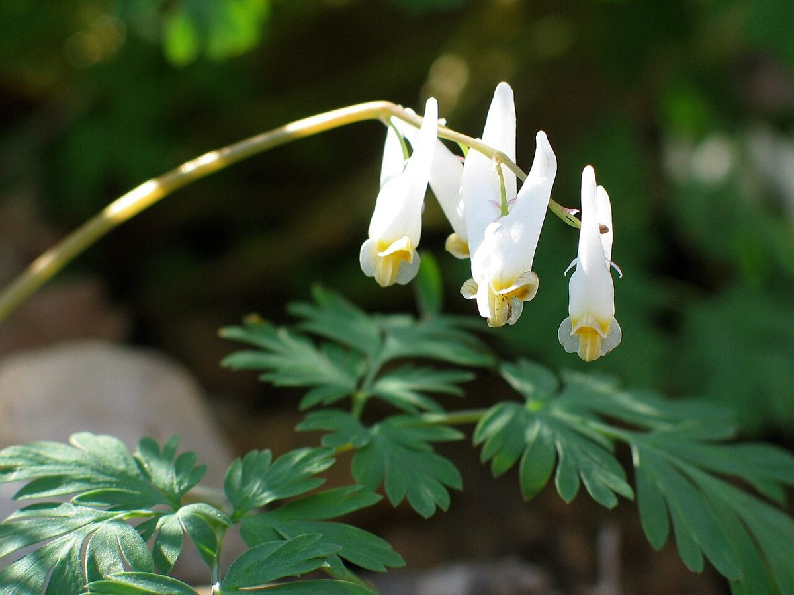
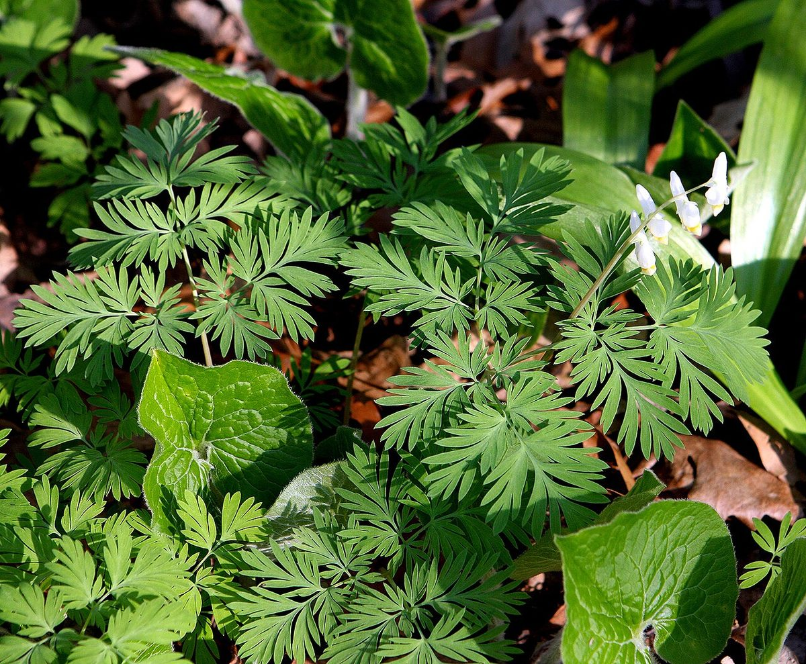

# Dutchman's Breeches

*Dicentra cucullaria*

Dicentra cucullaria, Dutchman's britches, or Dutchman's breeches, is a perennial herbaceous plant, native to rich woods of eastern North America, with a disjunct population in the Columbia Basin.
The common name Dutchman's breeches derives from their white flowers that look like white breeches.

## Quick Facts

| | |
|---|---|
| **Scientific name** | *Dicentra cucullaria* |
| **Family** | — |
| **Height** | — |
| **Bloom time** | — |
| **Sun** | — |
| **Moisture** | — |
| **Soil** | — |
| **Wildlife value** | — |

## Mentioned In

- [Woodland Forest Plants](../chapters/04-woodland-forest-plants/index.md)

## Image Credits

- Unknown (Public domain)
- Hardyplants at English Wikipedia (Public domain)

## Learn More

- [Wikipedia: Dicentra cucullaria](https://en.wikipedia.org/wiki/Dicentra_cucullaria)
