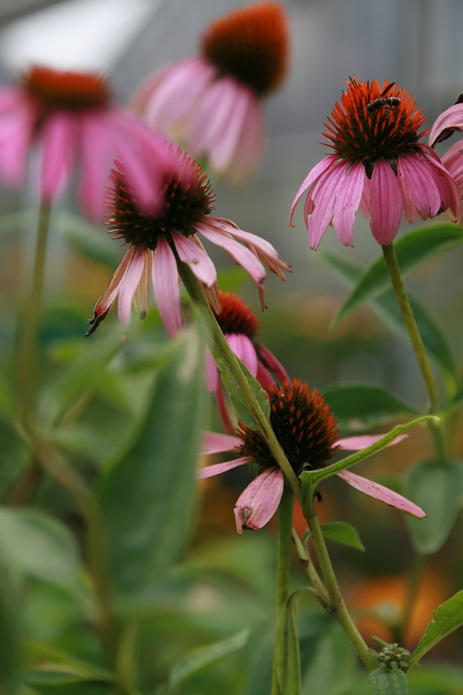

# Echinacea

*Echinacea angustifolia*

Echinacea angustifolia, the narrow-leaved purple coneflower or blacksamson echinacea, is a species of flowering plant in the family Asteraceae. It is native to North America, where it is widespread across much of the Great Plains of central Canada and the central United States, with additional populations in surrounding regions.
E. angustifolia is a perennial herb with spindle-shaped taproots that are often branched.

## Quick Facts

| | |
|---|---|
| **Scientific name** | *Echinacea angustifolia* |
| **Family** | — |
| **Height** | — |
| **Bloom time** | — |
| **Sun** | — |
| **Moisture** | — |
| **Soil** | — |
| **Wildlife value** | — |

## Mentioned In

- [Cultural Indigenous Uses](../chapters/13-cultural-indigenous-uses/index.md)

## Image Credits

- Ernie (CC BY-SA 3.0)
- Photo by David J. Stang (CC BY-SA 4.0)

## Learn More

- [Wikipedia: Echinacea angustifolia](https://en.wikipedia.org/wiki/Echinacea_angustifolia)
