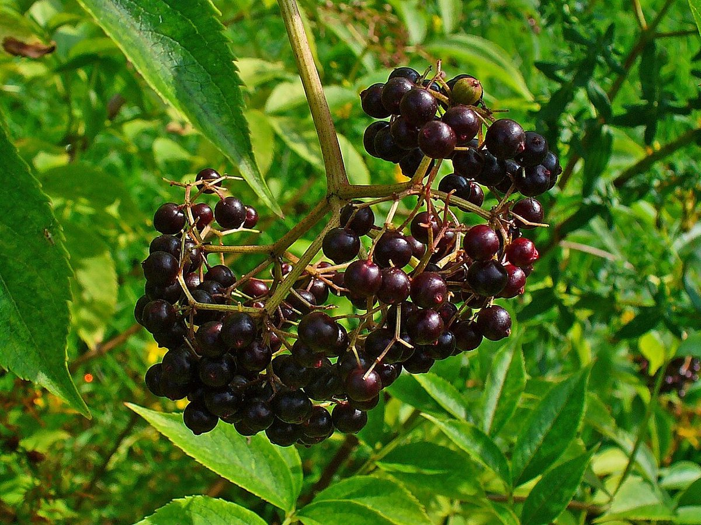
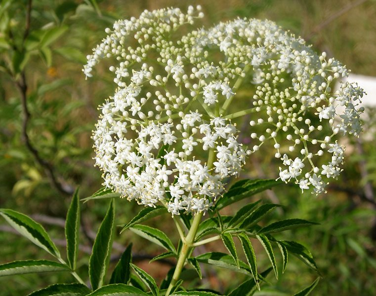

# Elderberry

*Sambucus canadensis*

Sambucus canadensis, the American black elderberry, Canada elderberry, or common elderberry, is a North American species of elderberry. Although many parts of the plant are toxic, including the seeds, the flower and ripe berries are edible—most safely after cooking.

## Quick Facts

| | |
|---|---|
| **Scientific name** | *Sambucus canadensis* |
| **Family** | — |
| **Height** | — |
| **Bloom time** | — |
| **Sun** | — |
| **Moisture** | — |
| **Soil** | — |
| **Wildlife value** | — |

## Mentioned In

- [Wetland Shoreline Plants](../chapters/05-wetland-shoreline-plants/index.md)

## Image Credits

- H. Zell (CC BY-SA 3.0)
- J.M.Garg (CC BY 3.0)

## Learn More

- [Wikipedia: Sambucus canadensis](https://en.wikipedia.org/wiki/Sambucus_canadensis)
