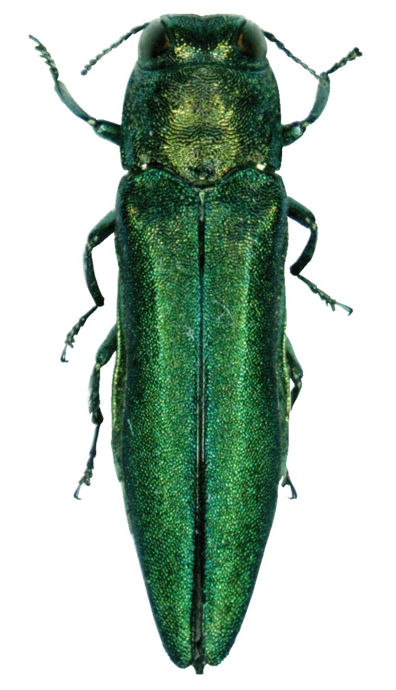
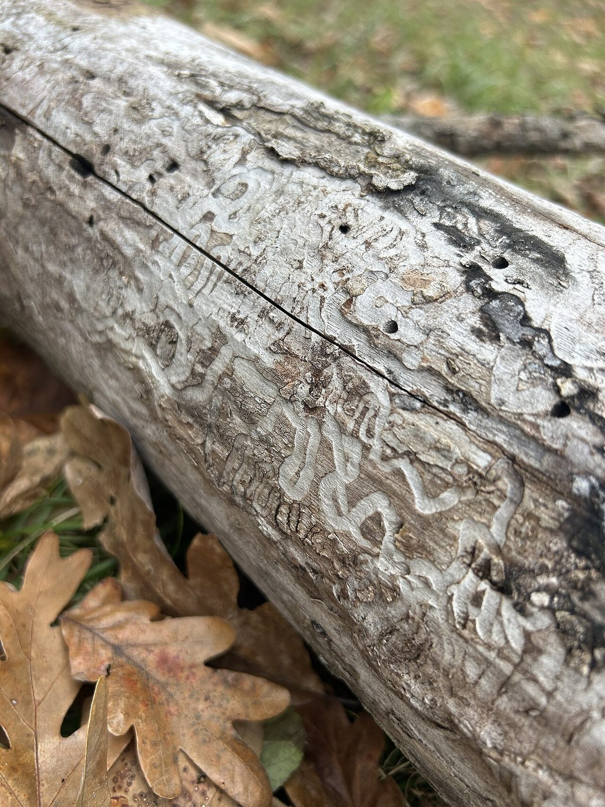

# Emerald Ash Borer

*Agrilus planipennis*

The emerald ash borer (Agrilus planipennis), also known by the abbreviation EAB, is a green buprestid or jewel beetle native to north-eastern Asia that feeds on ash species (Fraxinus spp.). Females lay eggs in bark crevices on ash trees, and larvae feed underneath the bark of ash trees to emerge as adults in one to two years. In its native range, it is typically found at low densities and does not cause significant damage to trees native to the area.

## Quick Facts

| | |
|---|---|
| **Scientific name** | *Agrilus planipennis* |
| **Family** | — |
| **Height** | — |
| **Bloom time** | — |
| **Sun** | — |
| **Moisture** | — |
| **Soil** | — |
| **Wildlife value** | — |

## Mentioned In

- [Invasive Species Id](../chapters/08-invasive-species-id/index.md)

## Image Credits

- Pennsylvania Department of Conservation and Natural Resources - Forestry Archive (CC BY 3.0 us)
- TheLostPariah (CC BY 4.0)

## Learn More

- [Wikipedia: Emerald ash borer](https://en.wikipedia.org/wiki/Emerald_ash_borer)
