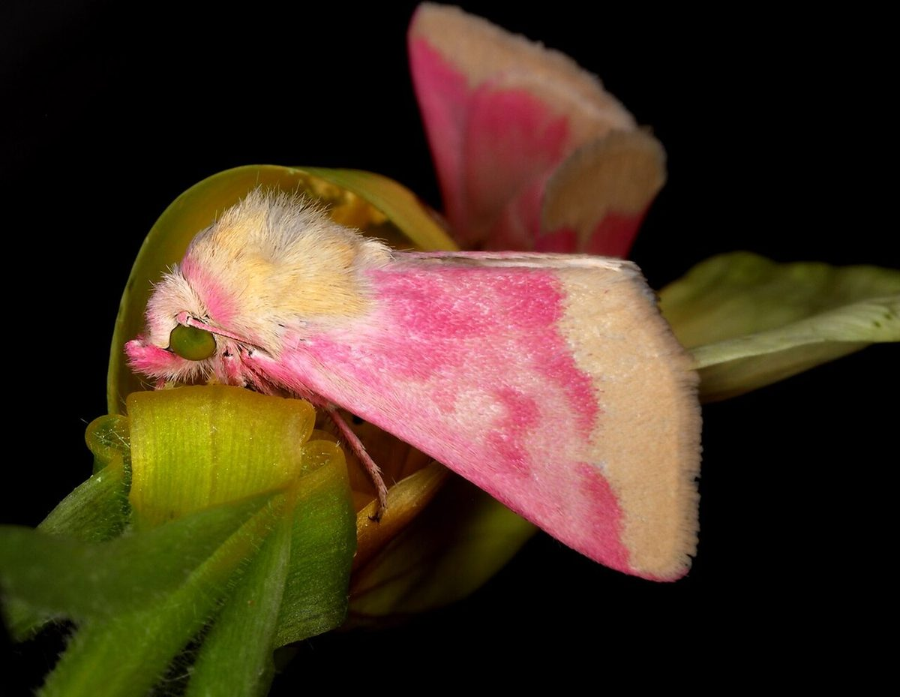
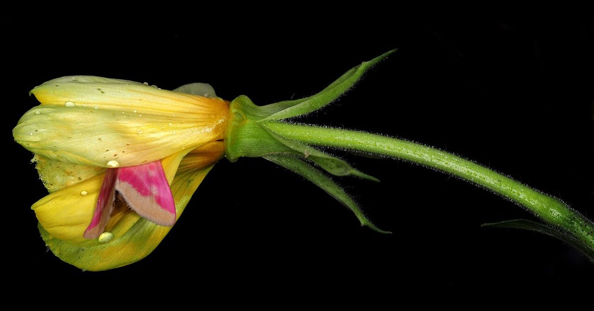

# Evening Primrose

*Oenothera biennis*

Oenothera biennis, the common evening-primrose, is a species of flowering plant in the family Onagraceae, native to eastern and central North America, from Newfoundland west to Alberta, southeast to Florida, and southwest to Texas, and widely naturalized elsewhere in temperate and subtropical regions. Evening primrose oil is produced from the plant.
Other common names include evening star, sundrop, weedy evening primrose, German rampion, hog weed, King's cure-all and fever-plant.

## Quick Facts

| | |
|---|---|
| **Scientific name** | *Oenothera biennis* |
| **Family** | — |
| **Height** | — |
| **Bloom time** | — |
| **Sun** | — |
| **Moisture** | — |
| **Soil** | — |
| **Wildlife value** | — |

## Mentioned In

- [Pollinators Wildlife](../chapters/06-pollinators-wildlife/index.md)

## Image Credits

- Djpmapleferryman (CC BY-SA 4.0)
- Djpmapleferryman (CC BY-SA 4.0)

## Learn More

- [Wikipedia: Oenothera biennis](https://en.wikipedia.org/wiki/Oenothera_biennis)
