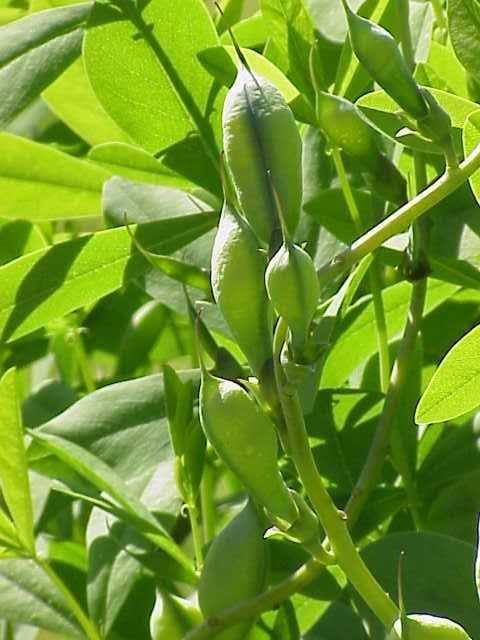

# False Blue Indigo

*Baptisia australis*

Baptisia australis, commonly known as blue wild indigo or blue false indigo, is a flowering plant in the family Fabaceae (legumes). It is a perennial herb native to much of central and eastern North America and is particularly common in the Midwest, but it has also been introduced well beyond its natural range. Naturally it can be found growing wild at the borders of woods, along streams or in open meadows.

## Quick Facts

| | |
|---|---|
| **Scientific name** | *Baptisia australis* |
| **Family** | — |
| **Height** | — |
| **Bloom time** | — |
| **Sun** | — |
| **Moisture** | — |
| **Soil** | — |
| **Wildlife value** | — |

## Mentioned In

- [Prairie Plants Grasslands](../chapters/03-prairie-plants-grasslands/index.md)

## Image Credits

- Eric Hunt (CC BY-SA 4.0)
- Unknown (CC BY-SA 3.0)

## Learn More

- [Wikipedia: Baptisia australis](https://en.wikipedia.org/wiki/Baptisia_australis)
