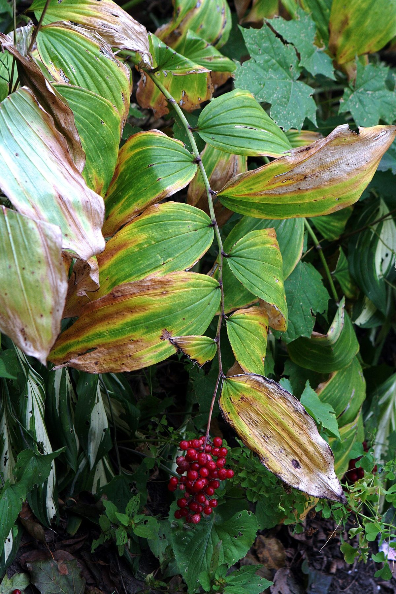
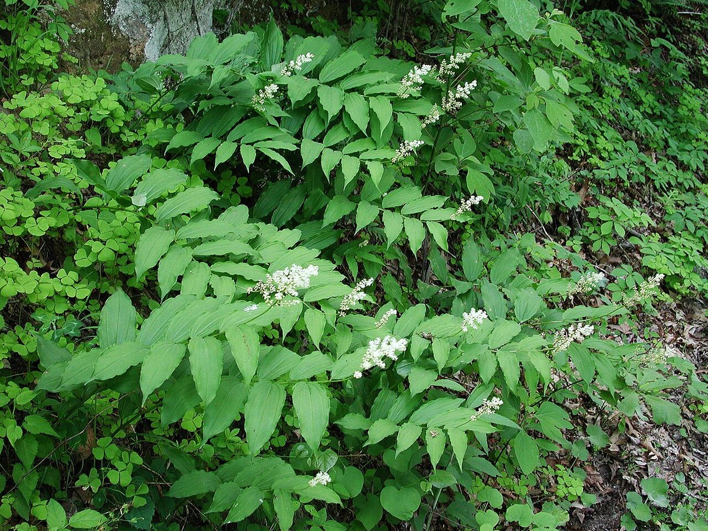

# False Solomon's Seal

*Maianthemum racemosum*

Maianthemum racemosum, the treacleberry, feathery false lily of the valley, false Solomon's seal, Solomon's plume or false spikenard, is a species of flowering plant native to North America. It is a common, widespread plant with numerous common names and synonyms, known from every US state except Hawaii, and from every Canadian province and territory (except Nunavut and the Yukon), as well as from Mexico.

## Quick Facts

| | |
|---|---|
| **Scientific name** | *Maianthemum racemosum* |
| **Family** | — |
| **Height** | — |
| **Bloom time** | — |
| **Sun** | — |
| **Moisture** | — |
| **Soil** | — |
| **Wildlife value** | — |

## Mentioned In

- [Woodland Forest Plants](../chapters/04-woodland-forest-plants/index.md)

## Image Credits

- Hardyplants (Public domain)
- Jaknouse (CC BY-SA 3.0)

## Learn More

- [Wikipedia: Maianthemum racemosum](https://en.wikipedia.org/wiki/Maianthemum_racemosum)
