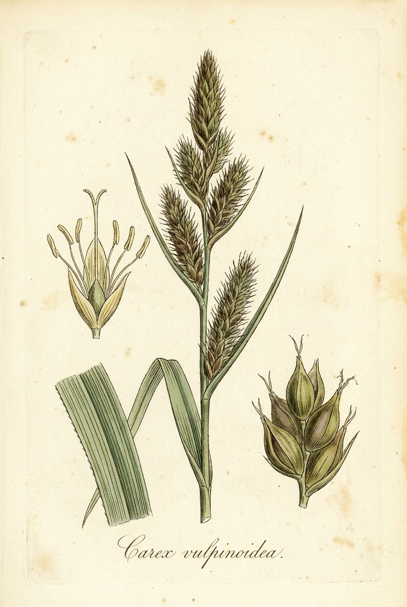

# Fox Sedge

*Carex vulpinoidea*

{ .plant-illustration }

*Botanical plate of* **Carex vulpinoidea** *— Curtis-style illustration.*

The genus Carex, the sedges, is one of the largest genera of flowering plants, containing over 2000 species, according to the Royal Botanic Gardens at Kew. In May 2015, the Global Carex Group argued for a broader circumscription of Carex, which added all the species formerly classified in Cymophyllus (1 species), Kobresia (c. 60 species), Schoenoxiphium (c.

## Quick Facts

| | |
|---|---|
| **Scientific name** | *Carex vulpinoidea* |
| **Family** | — |
| **Height** | — |
| **Bloom time** | — |
| **Sun** | — |
| **Moisture** | — |
| **Soil** | — |
| **Wildlife value** | — |

## Mentioned In

- [Wetland Shoreline Plants](../chapters/05-wetland-shoreline-plants/index.md)
- [Plant Identification Skills](../chapters/07-plant-identification-skills/index.md)
- [Garden Design Native Plants](../chapters/10-garden-design-native-plants/index.md)

## Image Credits

- Johann Georg Sturm (Painter: Jacob Sturm) (Public domain)

## Learn More

- [Wikipedia: List of Carex species](https://en.wikipedia.org/wiki/List_of_Carex_species)
