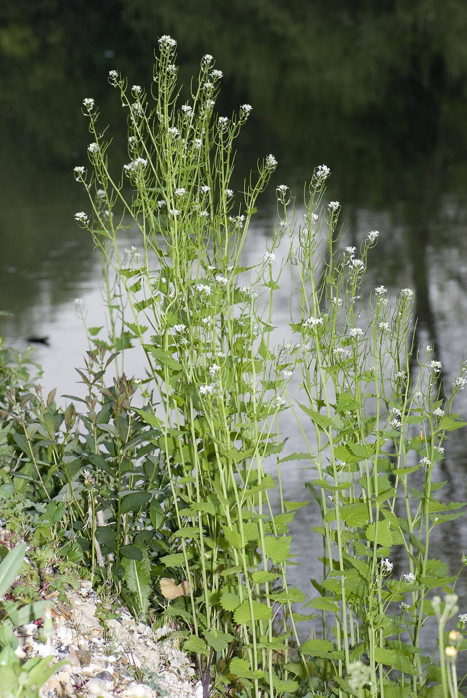

# Garlic Mustard

*Alliaria petiolata*

Alliaria petiolata, or  garlic mustard, is a biennial flowering plant in the mustard family (Brassicaceae). It is native to Europe, western and central Asia, north-western Africa, Morocco, Iberia and the British Isles, north to northern Scandinavia, and east to northern Pakistan and Xinjiang in western China. It has now become a tenacious invasive plant across the northern U.S., in particular because of its earlier springtime emergence than many native species, often in the forest understory.

## Quick Facts

| | |
|---|---|
| **Scientific name** | *Alliaria petiolata* |
| **Family** | — |
| **Height** | — |
| **Bloom time** | — |
| **Sun** | — |
| **Moisture** | — |
| **Soil** | — |
| **Wildlife value** | — |

## Mentioned In

- [Invasive Species Removal](../chapters/09-invasive-species-removal/index.md)

## Image Credits

- Didier Descouens (CC BY-SA 4.0)
- O. Pichard (CC BY-SA 3.0)

## Learn More

- [Wikipedia: Alliaria petiolata](https://en.wikipedia.org/wiki/Alliaria_petiolata)
