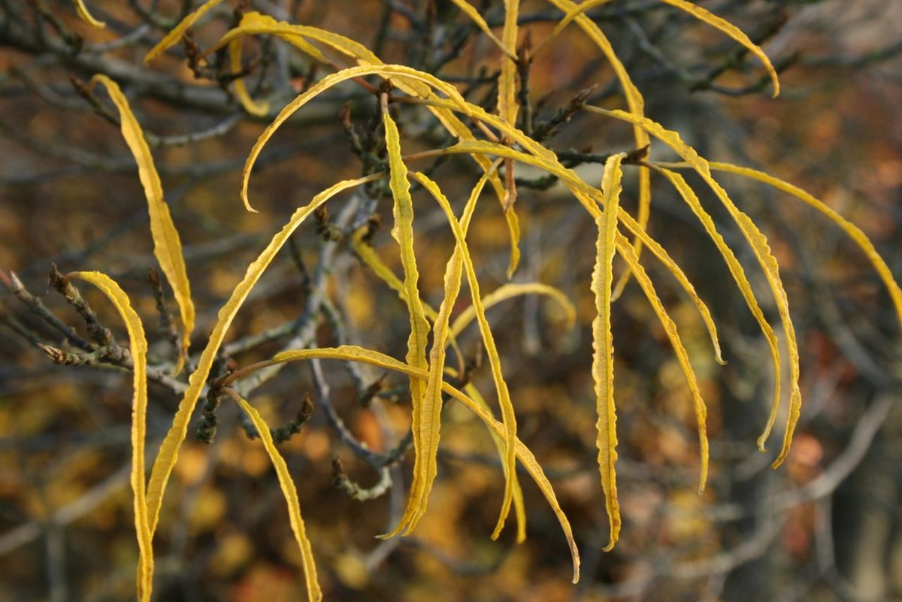

# Glossy Buckthorn

*Frangula alnus*

Frangula alnus, commonly known as alder buckthorn, glossy buckthorn, or breaking buckthorn, is a tall deciduous shrub in the family Rhamnaceae. Unlike other "buckthorns", alder buckthorn does not have thorns. It is native to Europe, northernmost Africa, and western Asia, from Ireland and Great Britain north to the 68th parallel in Scandinavia, east to central Siberia and Xinjiang in western China, and south to northern Morocco, Turkey, and the Alborz in Iran and the Caucasus Mountains; in the northwest of its range (Ireland, Scotland), it is rare and scattered.

## Quick Facts

| | |
|---|---|
| **Scientific name** | *Frangula alnus* |
| **Family** | — |
| **Height** | — |
| **Bloom time** | — |
| **Sun** | — |
| **Moisture** | — |
| **Soil** | — |
| **Wildlife value** | — |

## Mentioned In

- [Invasive Species Id](../chapters/08-invasive-species-id/index.md)

## Image Credits

- Patrick Roper (CC BY-SA 2.0)
- Sten Porse (CC BY-SA 3.0)

## Learn More

- [Wikipedia: Frangula alnus](https://en.wikipedia.org/wiki/Frangula_alnus)
