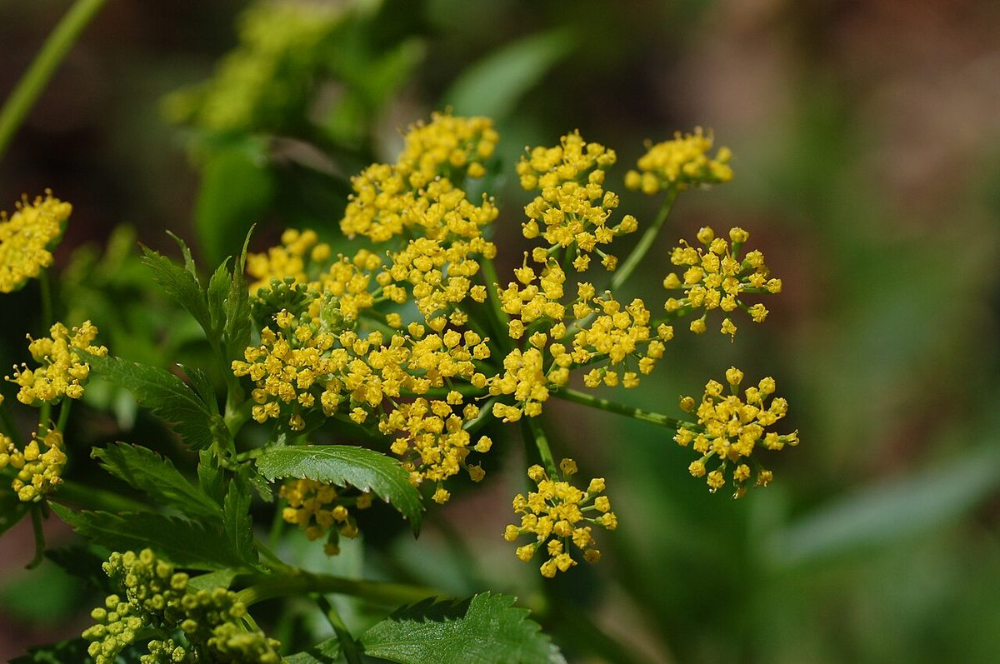
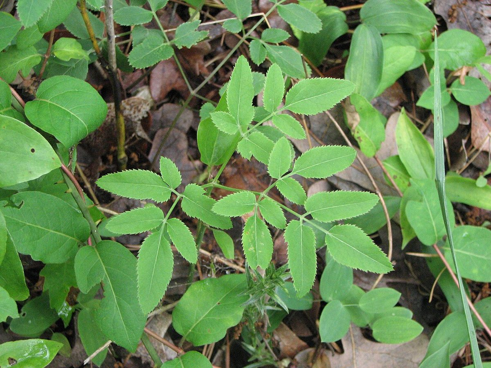

# Golden Alexanders

*Zizia aurea*

Zizia aurea (golden alexanders, golden zizia) is a flowering herbaceous perennial plant of the carrot family Apiaceae. It is native to eastern Canada and the United States, from the eastern Great Plains to the Atlantic Coast. The genus is named for Johann Baptist Ziz, a German botanist.

## Quick Facts

| | |
|---|---|
| **Scientific name** | *Zizia aurea* |
| **Family** | — |
| **Height** | — |
| **Bloom time** | — |
| **Sun** | — |
| **Moisture** | — |
| **Soil** | — |
| **Wildlife value** | — |

## Mentioned In

- [Pollinators Wildlife](../chapters/06-pollinators-wildlife/index.md)
- [Plant Identification Skills](../chapters/07-plant-identification-skills/index.md)
- [Garden Design Native Plants](../chapters/10-garden-design-native-plants/index.md)

## Image Credits

- Photo by and (c)2007 Derek Ramsey (Ram-Man) (GFDL 1.2)
- Choess (CC BY-SA 3.0)

## Learn More

- [Wikipedia: Zizia aurea](https://en.wikipedia.org/wiki/Zizia_aurea)
