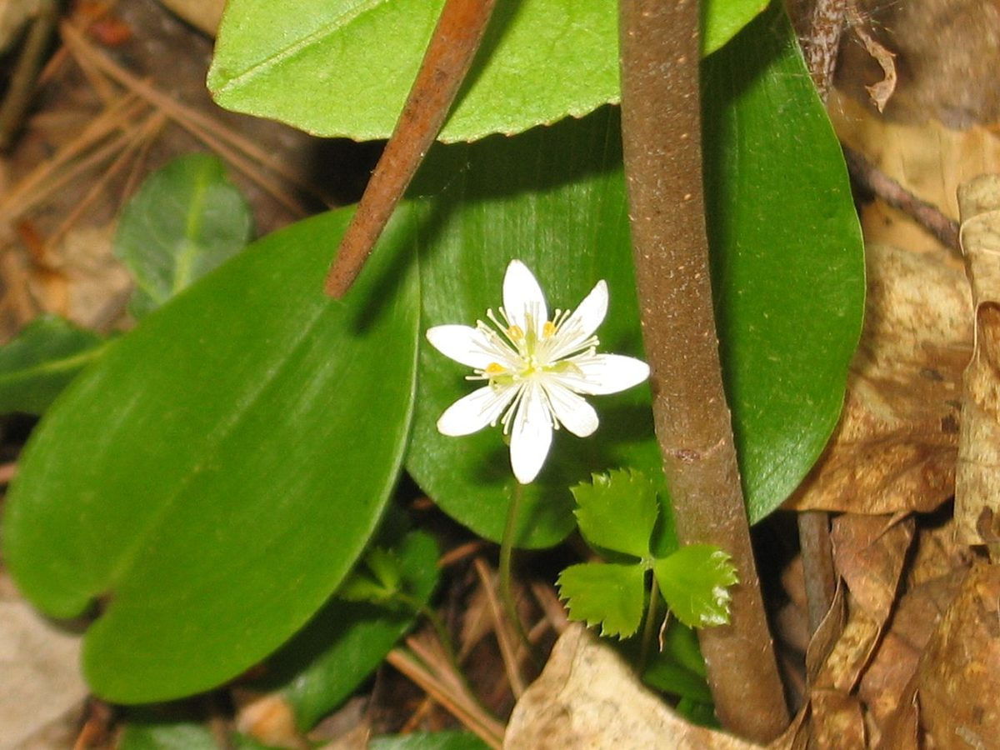
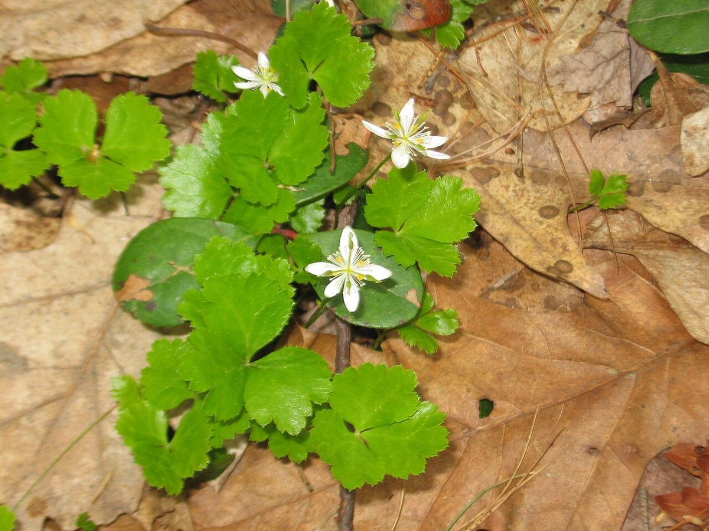

# Goldthread

*Coptis trifolia*

Coptis trifolia, commonly known as the threeleaf goldthread or savoyane, is a perennial plant in the family Ranunculaceae native to North America.

## Quick Facts

| | |
|---|---|
| **Scientific name** | *Coptis trifolia* |
| **Family** | — |
| **Height** | — |
| **Bloom time** | — |
| **Sun** | — |
| **Moisture** | — |
| **Soil** | — |
| **Wildlife value** | — |

## Mentioned In

- [Cultural Indigenous Uses](../chapters/13-cultural-indigenous-uses/index.md)

## Image Credits

- Jomegat (CC BY-SA 3.0)
- Jomegat (CC BY-SA 3.0)

## Learn More

- [Wikipedia: Coptis trifolia](https://en.wikipedia.org/wiki/Coptis_trifolia)
