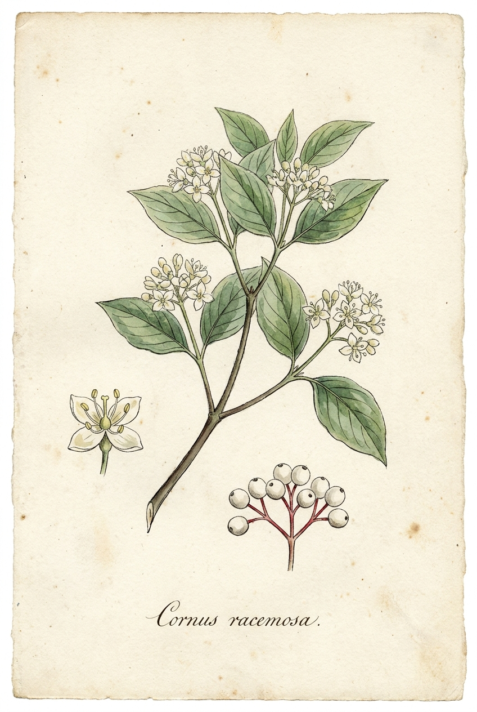
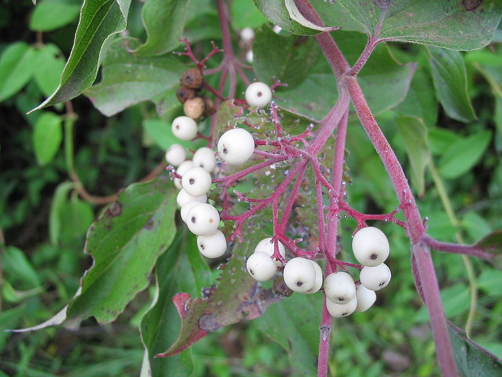

# Gray Dogwood

*Cornus racemosa*

{ .plant-illustration }

*Botanical plate of* **Cornus racemosa** *— Curtis-style illustration.*

Cornus racemosa, the northern swamp dogwood, gray dogwood, or panicle dogwood, is a shrubby plant native to southeastern Canada and the northeastern United States. It is a member of the dogwood genus Cornus and the family Cornaceae.

## Quick Facts

| | |
|---|---|
| **Scientific name** | *Cornus racemosa* |
| **Family** | — |
| **Height** | — |
| **Bloom time** | — |
| **Sun** | — |
| **Moisture** | — |
| **Soil** | — |
| **Wildlife value** | — |

## Mentioned In

- [Garden Design Native Plants](../chapters/10-garden-design-native-plants/index.md)

## Image Credits

- Elbert L. Little, Jr., of the U.S. Department of Agriculture, Forest Service, and others (Public domain)
- Mitternacht90 at English Wikipedia (Public domain)

## Learn More

- [Wikipedia: Cornus racemosa](https://en.wikipedia.org/wiki/Cornus_racemosa)
