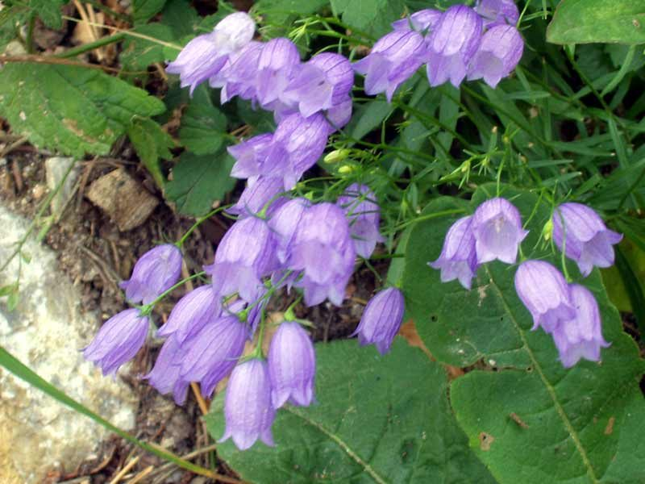
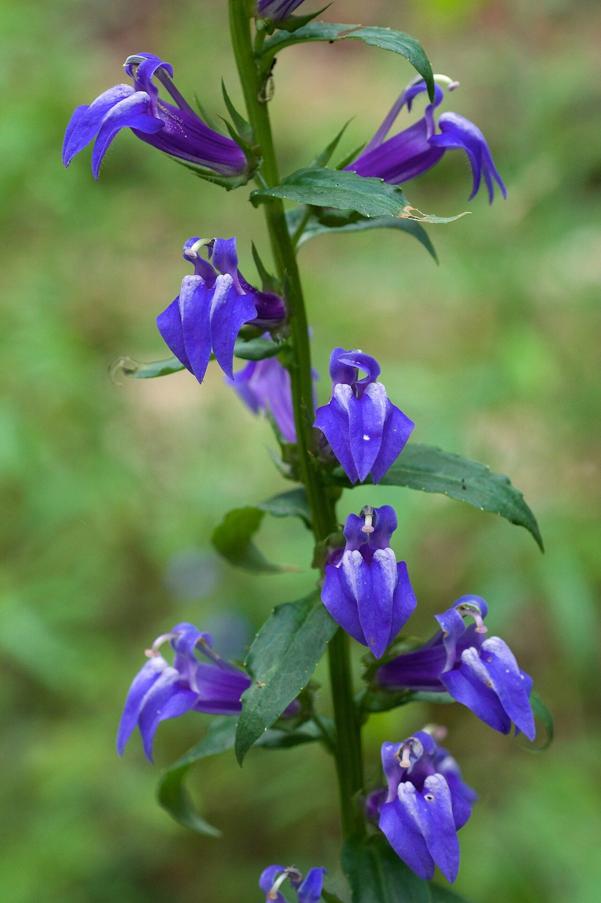

# Great Blue Lobelia

*Lobelia siphilitica*

Lobelia siphilitica, the great blue lobelia, great lobelia, or blue cardinal flower, is a plant species within the family Campanulaceae. It is an herbaceous perennial dicot native to eastern and central Canada and United States. There are two recognized varieties of Lobelia siphilitica, var.

## Quick Facts

| | |
|---|---|
| **Scientific name** | *Lobelia siphilitica* |
| **Family** | — |
| **Height** | — |
| **Bloom time** | — |
| **Sun** | — |
| **Moisture** | — |
| **Soil** | — |
| **Wildlife value** | — |

## Mentioned In

- [Wetland Shoreline Plants](../chapters/05-wetland-shoreline-plants/index.md)
- [Pollinators Wildlife](../chapters/06-pollinators-wildlife/index.md)
- [Garden Design Native Plants](../chapters/10-garden-design-native-plants/index.md)

## Image Credits

- Unknown (Public domain)
- Eric Hunt (CC BY-SA 4.0)

## Learn More

- [Wikipedia: Lobelia siphilitica](https://en.wikipedia.org/wiki/Lobelia_siphilitica)
