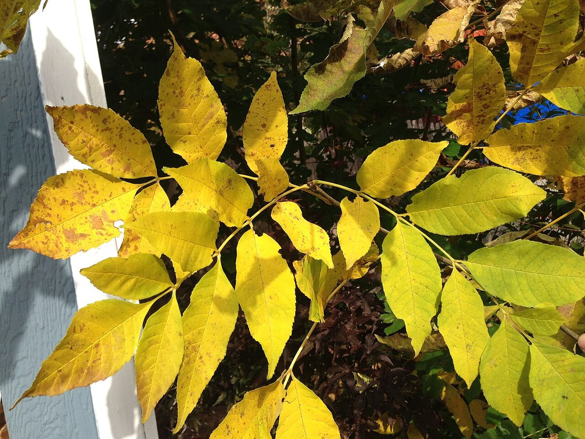
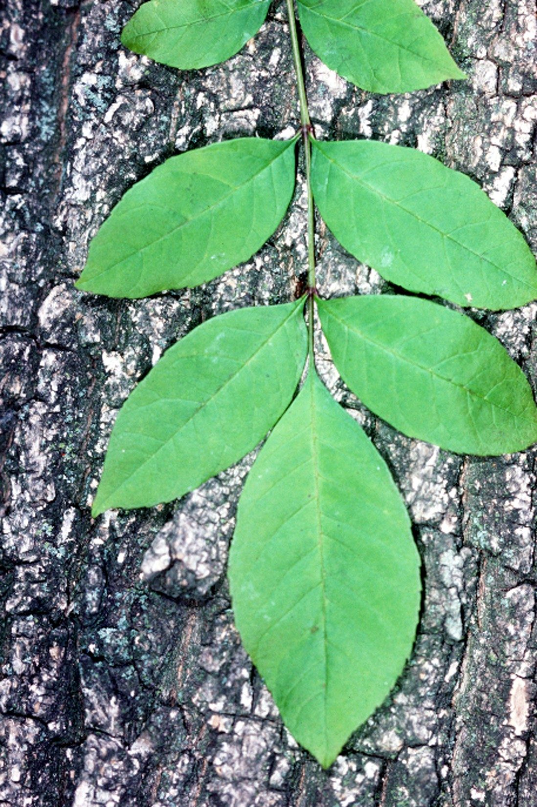

# Green Ash

*Fraxinus pennsylvanica*

Fraxinus pennsylvanica, the green ash or red ash, is a species of ash native to eastern and central North America, from Nova Scotia west to southeastern Alberta and eastern Colorado, south to northern Florida, and southwest to Oklahoma and eastern Texas. It has spread and become naturalized in much of the western United States and also in Argentina and Europe, from Spain to Russia.
Other names more rarely used include downy ash, swamp ash, and water ash.

## Quick Facts

| | |
|---|---|
| **Scientific name** | *Fraxinus pennsylvanica* |
| **Family** | — |
| **Height** | — |
| **Bloom time** | — |
| **Sun** | — |
| **Moisture** | — |
| **Soil** | — |
| **Wildlife value** | — |

## Mentioned In

- [Invasive Species Id](../chapters/08-invasive-species-id/index.md)

## Image Credits

- Famartin (CC BY-SA 4.0)
- Unknown (Public domain)

## Learn More

- [Wikipedia: Fraxinus pennsylvanica](https://en.wikipedia.org/wiki/Fraxinus_pennsylvanica)
