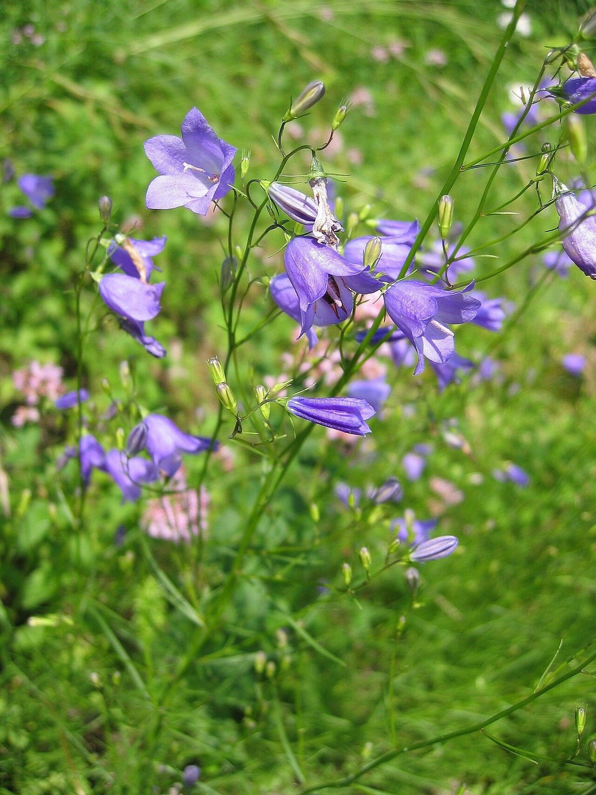

# Harebell

*Campanula rotundifolia*

Campanula rotundifolia, the harebell or common harebell, Scottish bluebell, or bluebell in Scotland, is a species of flowering plant in the bellflower family Campanulaceae. This herbaceous perennial is found throughout the north temperate regions of the Old World according to the Plants of the World Online database, or throughout the northern hemisphere in other interpretations (see Taxonomy, below). In Scotland, it is often known simply as bluebell.

## Quick Facts

| | |
|---|---|
| **Scientific name** | *Campanula rotundifolia* |
| **Family** | — |
| **Height** | — |
| **Bloom time** | — |
| **Sun** | — |
| **Moisture** | — |
| **Soil** | — |
| **Wildlife value** | — |

## Mentioned In

- [Ecological Restoration](../chapters/12-ecological-restoration/index.md)

## Image Credits

- Arnstein Rønning (CC BY-SA 3.0)
- Unknown (CC BY-SA 3.0)

## Learn More

- [Wikipedia: Campanula rotundifolia](https://en.wikipedia.org/wiki/Campanula_rotundifolia)
