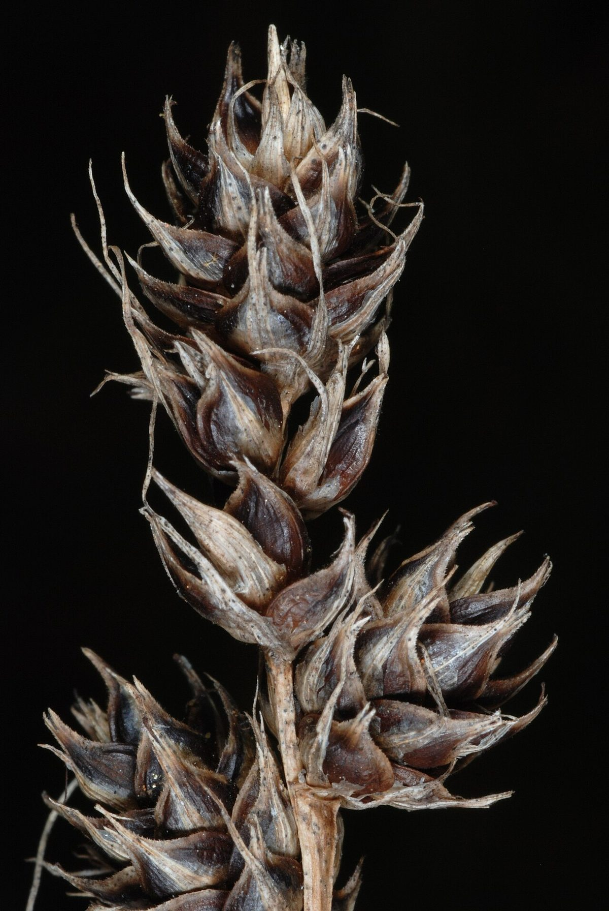

# Heavy Sedge

*Carex gravida*

Carex gravida, also known as heavy-fruited sedge, heavy sedge or long-awned bracted sedge, is a tussock-forming species of perennial sedge in the family Cyperaceae. It is native to southern parts of Canada and parts of the United States.

## Quick Facts

| | |
|---|---|
| **Scientific name** | *Carex gravida* |
| **Family** | Cyperaceae |
| **Height** | 1-3 ft |
| **Bloom time** | May-Jun |
| **Sun** | Full sun |
| **Moisture** | Dry to mesic |
| **Soil** | Loam, clay |
| **Wildlife value** | Dry-prairie sedge; early green-up before the warm-season grasses |

## Mentioned In

- [Prairie Plants Grasslands](../chapters/03-prairie-plants-grasslands/index.md)

## Image Credits

- Doug Goldman. Provided by USDA NRCS National Plants Data Team (NPDT). United States, VA, Bedford Co. July 16, 2011. (Public domain)

## Learn More

- [Wikipedia: Carex gravida](https://en.wikipedia.org/wiki/Carex_gravida)
