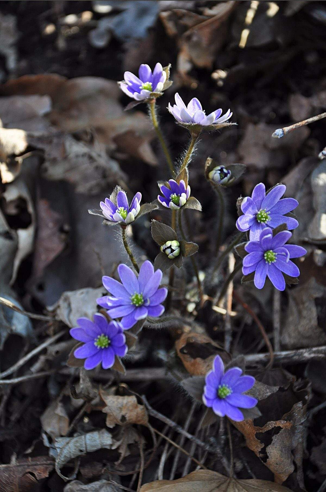

# Hepatica

*Hepatica nobilis*

Anemone hepatica (syn. Hepatica nobilis), the common hepatica, liverwort, liverleaf, kidneywort, or pennywort, is a species of flowering plant in the buttercup family Ranunculaceae, native to woodland in temperate regions of the Northern Hemisphere. This herbaceous perennial grows from a rhizome.

## Quick Facts

| | |
|---|---|
| **Scientific name** | *Hepatica nobilis* |
| **Family** | — |
| **Height** | — |
| **Bloom time** | — |
| **Sun** | — |
| **Moisture** | — |
| **Soil** | — |
| **Wildlife value** | — |

## Mentioned In

- [Ecological Restoration](../chapters/12-ecological-restoration/index.md)

## Image Credits

- Tulipasylvestris (CC BY-SA 4.0)
- Hyunjung Kim (CC0)

## Learn More

- [Wikipedia: Anemone hepatica](https://en.wikipedia.org/wiki/Anemone_hepatica)
