# Minnesota Native Plant Gallery

Click any plant to see photos, growing conditions, and the chapters that mention it. Currently featuring the 30 most-mentioned species from the textbook.

_30 species in this gallery._

## All Species

| Plant | Scientific Name | Mentioned In |
|-------|-----------------|--------------|
| [Big Bluestem](big-bluestem.md) | *Andropogon gerardii* | 03, 05 |
| [Black Ash](black-ash.md) | *Fraxinus nigra* | 02, 08 |
| [Black-Eyed Susan](black-eyed-susan.md) | *Rudbeckia hirta* | 03, 06, 10, 11 |
| [Blazing Star](blazing-star.md) | *Liatris ligulistylis* | 06, 10 |
| [Bloodroot](bloodroot.md) | *Sanguinaria canadensis* | 04, 10 |
| [Blue Flag Iris](blue-flag-iris.md) | *Iris versicolor* | 02, 05 |
| [Butterfly Milkweed](butterfly-milkweed.md) | *Asclepias tuberosa* | 02, 06, 10, 11 |
| [Cardinal Flower](cardinal-flower.md) | *Lobelia cardinalis* | 05, 06, 10 |
| [Common Buckthorn](common-buckthorn.md) | *Rhamnus cathartica* | 08, 09 |
| [Cup Plant](cup-plant.md) | *Silphium perfoliatum* | 06, 10 |
| [Garlic Mustard](garlic-mustard.md) | *Alliaria petiolata* | 08, 09 |
| [Golden Alexanders](golden-alexanders.md) | *Zizia aurea* | 06, 07, 10 |
| [Great Blue Lobelia](great-blue-lobelia.md) | *Lobelia siphilitica* | 05, 06, 10 |
| [Jack-in-the-Pulpit](jack-in-the-pulpit.md) | *Arisaema triphyllum* | 04, 06 |
| [Joe Pye Weed](joe-pye-weed.md) | *Eutrochium maculatum* | 02, 05, 06, 10 |
| [New England Aster](new-england-aster.md) | *Symphyotrichum novae-angliae* | 06, 10 |
| [Pasque Flower](pasque-flower.md) | *Anemone patens* | 02, 06 |
| [Purple Coneflower](purple-coneflower.md) | *Echinacea purpurea* | 03, 06, 10, 11 |
| [Showy Goldenrod](showy-goldenrod.md) | *Solidago speciosa* | 06, 10 |
| [Silver Maple](silver-maple.md) | *Acer saccharinum* | 02, 05 |
| [Smooth Blue Aster](smooth-blue-aster.md) | *Symphyotrichum laeve* | 06, 10 |
| [Stiff Goldenrod](stiff-goldenrod.md) | *Solidago rigida* | 06, 10 |
| [Swamp Milkweed](swamp-milkweed.md) | *Asclepias incarnata* | 02, 05 |
| [Switchgrass](switchgrass.md) | *Panicum virgatum* | 03, 05 |
| [Tamarack](tamarack.md) | *Larix laricina* | 02, 05 |
| [Virginia Bluebells](virginia-bluebells.md) | *Mertensia virginica* | 06, 10 |
| [Wild Bergamot](wild-bergamot.md) | *Monarda fistulosa* | 03, 06, 10, 11 |
| [Wild Columbine](wild-columbine.md) | *Aquilegia canadensis* | 06, 10 |
| [Wild Ginger](wild-ginger.md) | *Asarum canadense* | 04, 06 |
| [Wild Parsnip](wild-parsnip.md) | *Pastinaca sativa* | 07, 08 |

## Visual Gallery

<a href="big-bluestem.md" class="plant-gallery-card">
Big Bluestem <em>Andropogon gerardii</em>
</a>
<a href="black-ash.md" class="plant-gallery-card">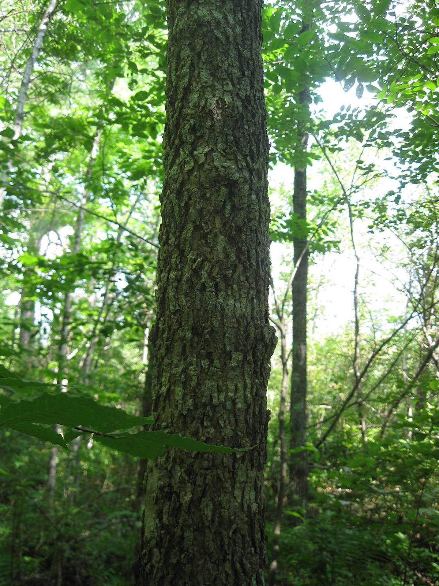
Black Ash <em>Fraxinus nigra</em>
</a>
<a href="black-eyed-susan.md" class="plant-gallery-card">
Black-Eyed Susan <em>Rudbeckia hirta</em>
</a>
<a href="blazing-star.md" class="plant-gallery-card">
Blazing Star <em>Liatris ligulistylis</em>
</a>
<a href="bloodroot.md" class="plant-gallery-card">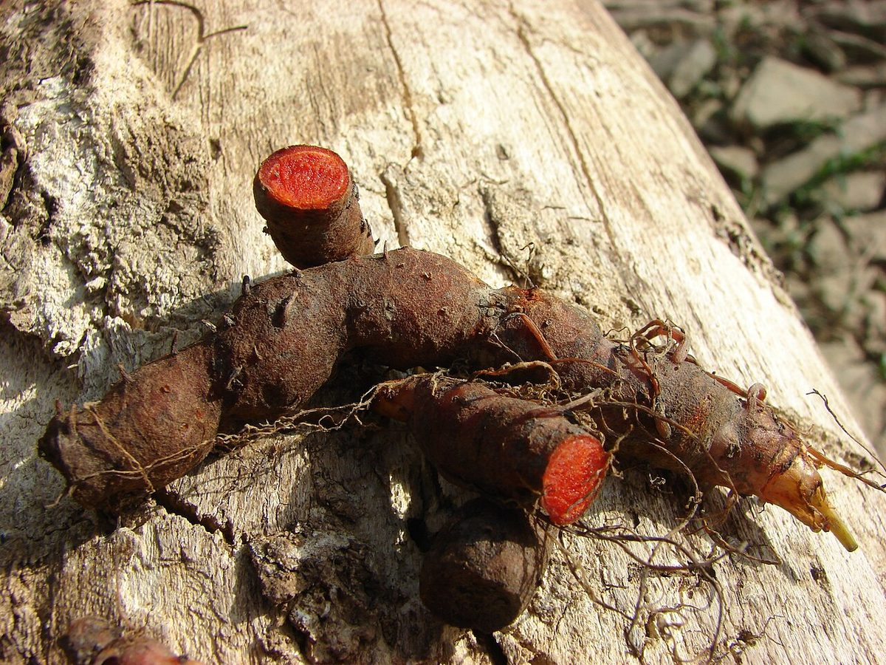
Bloodroot <em>Sanguinaria canadensis</em>
</a>
<a href="blue-flag-iris.md" class="plant-gallery-card">
Blue Flag Iris <em>Iris versicolor</em>
</a>
<a href="butterfly-milkweed.md" class="plant-gallery-card">
Butterfly Milkweed <em>Asclepias tuberosa</em>
</a>
<a href="cardinal-flower.md" class="plant-gallery-card">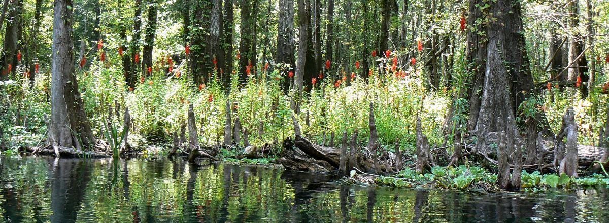
Cardinal Flower <em>Lobelia cardinalis</em>
</a>
<a href="common-buckthorn.md" class="plant-gallery-card">
Common Buckthorn <em>Rhamnus cathartica</em>
</a>
<a href="cup-plant.md" class="plant-gallery-card">
Cup Plant <em>Silphium perfoliatum</em>
</a>
<a href="garlic-mustard.md" class="plant-gallery-card">
Garlic Mustard <em>Alliaria petiolata</em>
</a>
<a href="golden-alexanders.md" class="plant-gallery-card">
Golden Alexanders <em>Zizia aurea</em>
</a>
<a href="great-blue-lobelia.md" class="plant-gallery-card">
Great Blue Lobelia <em>Lobelia siphilitica</em>
</a>
<a href="jack-in-the-pulpit.md" class="plant-gallery-card">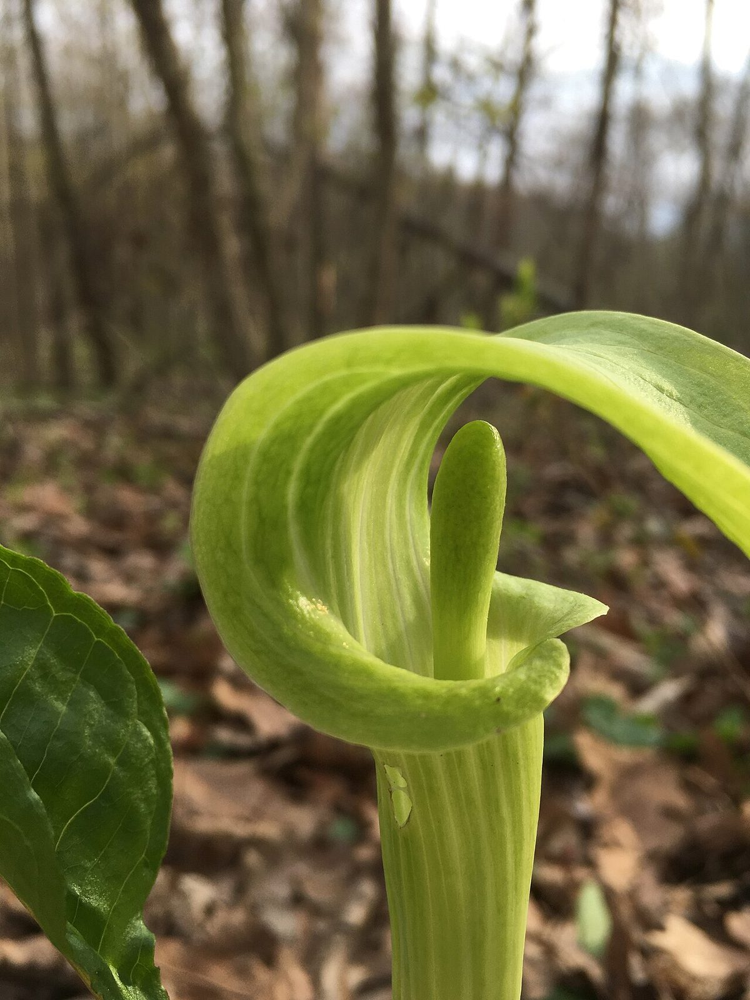
Jack-in-the-Pulpit <em>Arisaema triphyllum</em>
</a>
<a href="joe-pye-weed.md" class="plant-gallery-card">
Joe Pye Weed <em>Eutrochium maculatum</em>
</a>
<a href="new-england-aster.md" class="plant-gallery-card">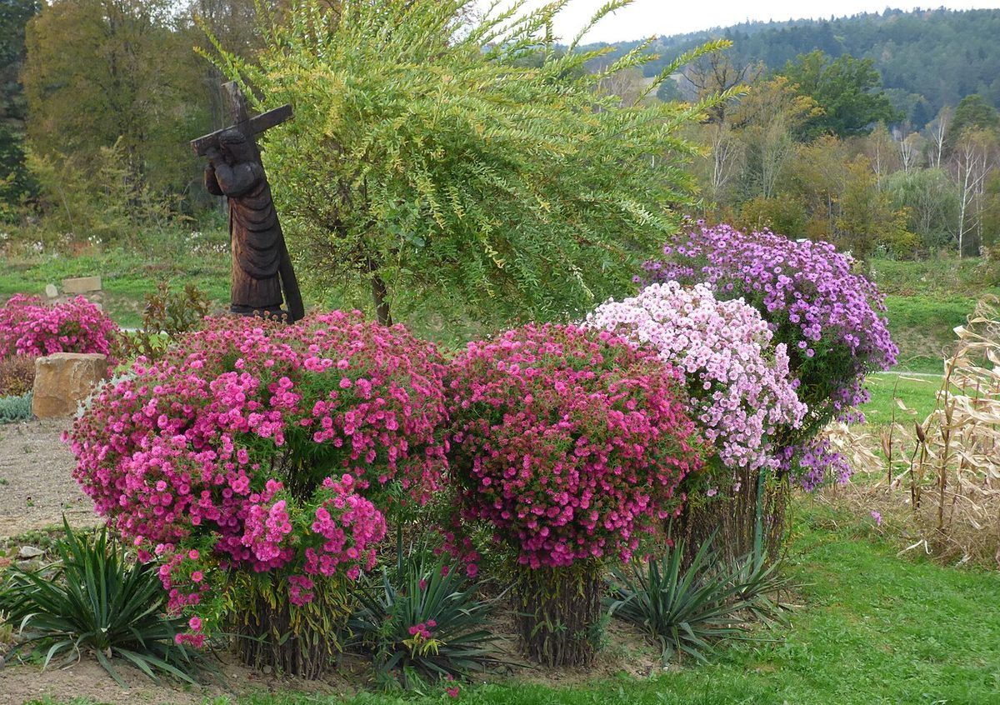
New England Aster <em>Symphyotrichum novae-angliae</em>
</a>
<a href="pasque-flower.md" class="plant-gallery-card">
Pasque Flower <em>Anemone patens</em>
</a>
<a href="purple-coneflower.md" class="plant-gallery-card">
Purple Coneflower <em>Echinacea purpurea</em>
</a>
<a href="showy-goldenrod.md" class="plant-gallery-card">
Showy Goldenrod <em>Solidago speciosa</em>
</a>
<a href="silver-maple.md" class="plant-gallery-card">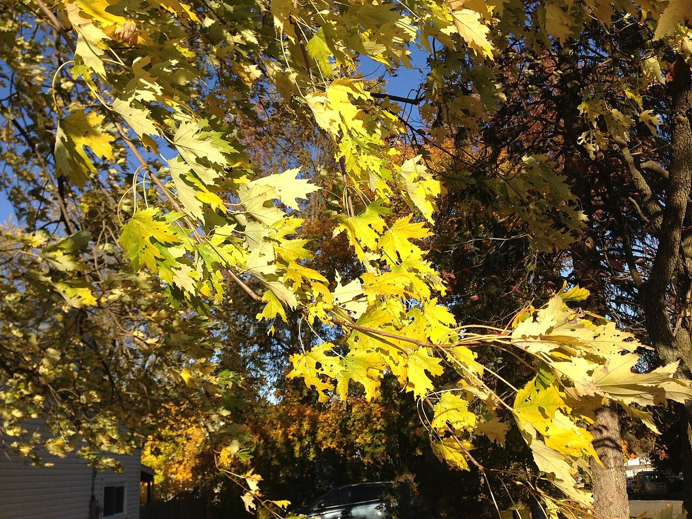
Silver Maple <em>Acer saccharinum</em>
</a>
<a href="smooth-blue-aster.md" class="plant-gallery-card">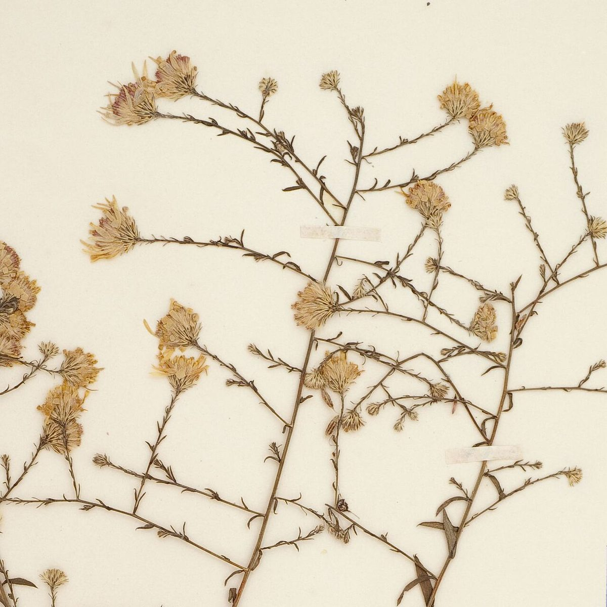
Smooth Blue Aster <em>Symphyotrichum laeve</em>
</a>
<a href="stiff-goldenrod.md" class="plant-gallery-card">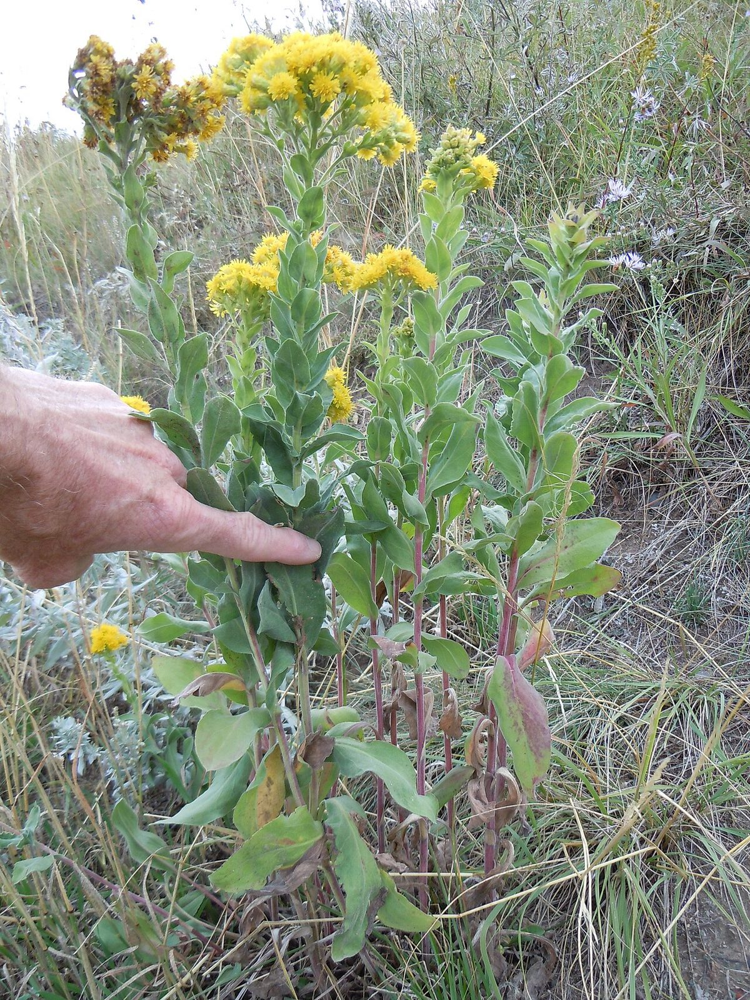
Stiff Goldenrod <em>Solidago rigida</em>
</a>
<a href="swamp-milkweed.md" class="plant-gallery-card">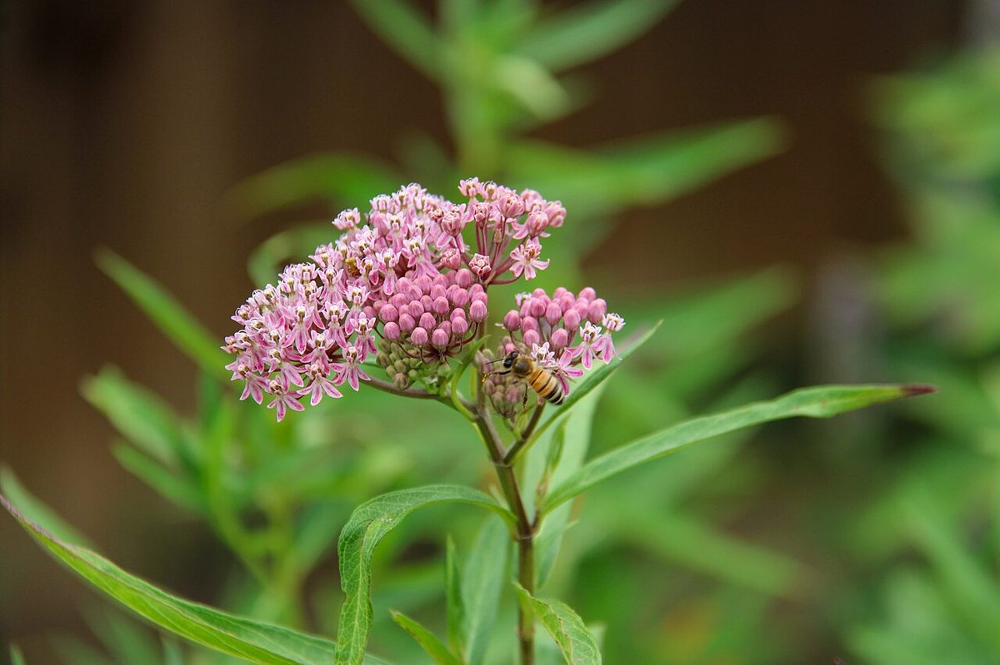
Swamp Milkweed <em>Asclepias incarnata</em>
</a>
<a href="switchgrass.md" class="plant-gallery-card">
Switchgrass <em>Panicum virgatum</em>
</a>
<a href="tamarack.md" class="plant-gallery-card">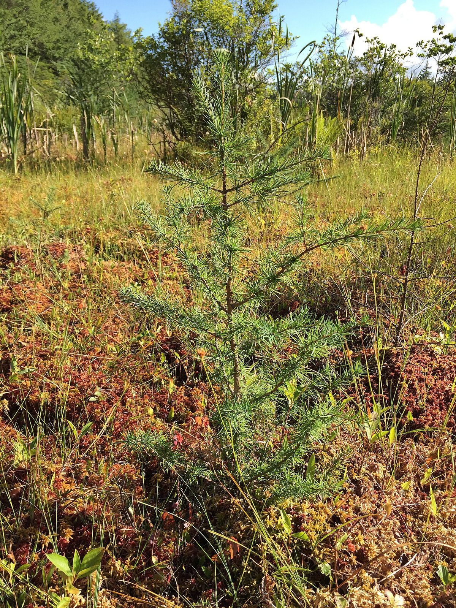
Tamarack <em>Larix laricina</em>
</a>
<a href="virginia-bluebells.md" class="plant-gallery-card">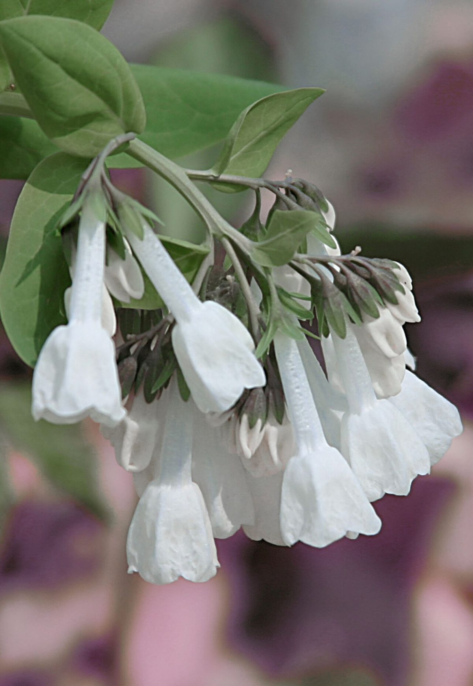
Virginia Bluebells <em>Mertensia virginica</em>
</a>
<a href="wild-bergamot.md" class="plant-gallery-card">
Wild Bergamot <em>Monarda fistulosa</em>
</a>
<a href="wild-columbine.md" class="plant-gallery-card">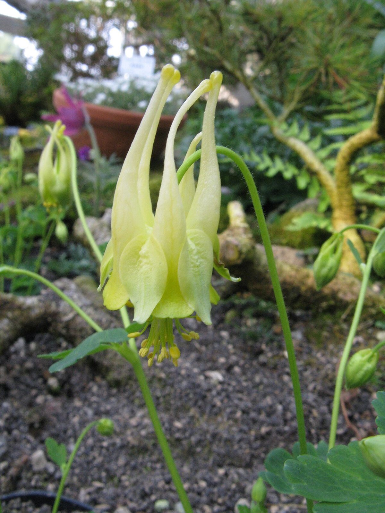
Wild Columbine <em>Aquilegia canadensis</em>
</a>
<a href="wild-ginger.md" class="plant-gallery-card">
Wild Ginger <em>Asarum canadense</em>
</a>
<a href="wild-parsnip.md" class="plant-gallery-card">
Wild Parsnip <em>Pastinaca sativa</em>
</a>

