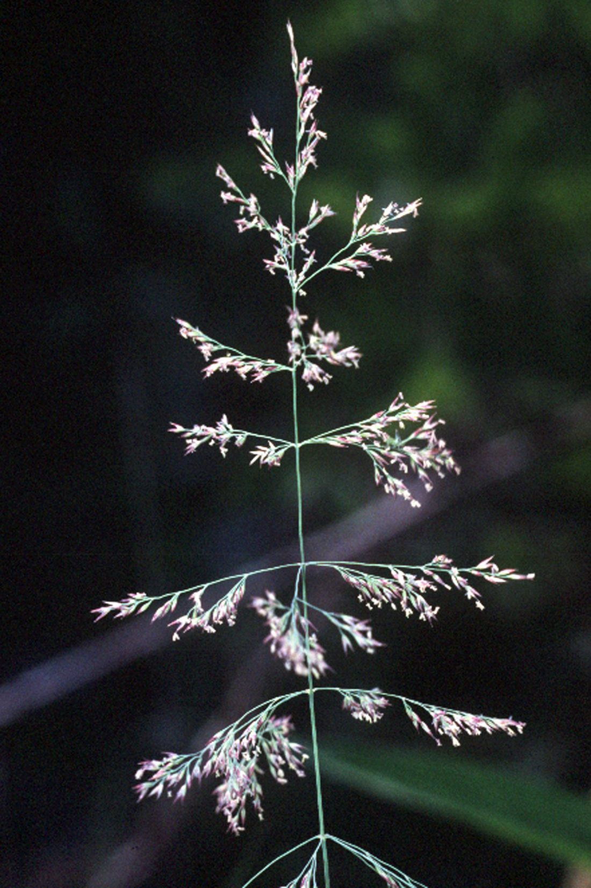
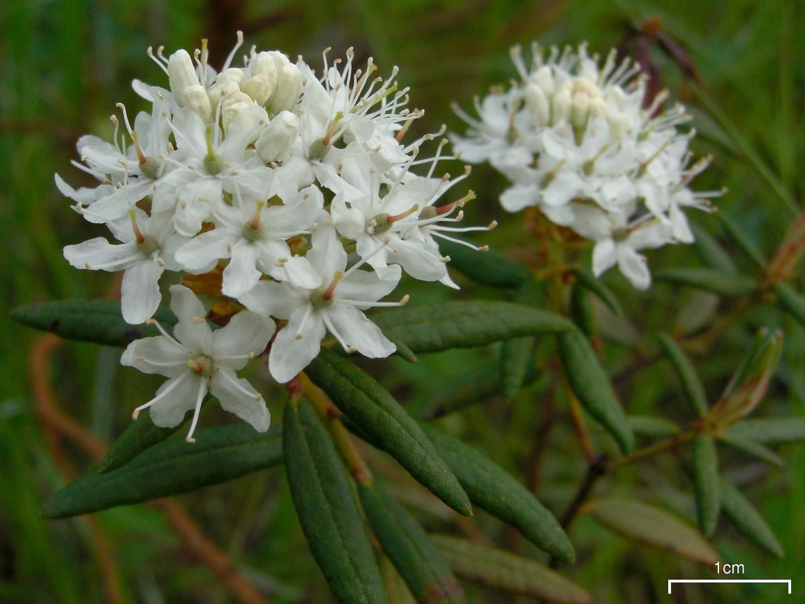
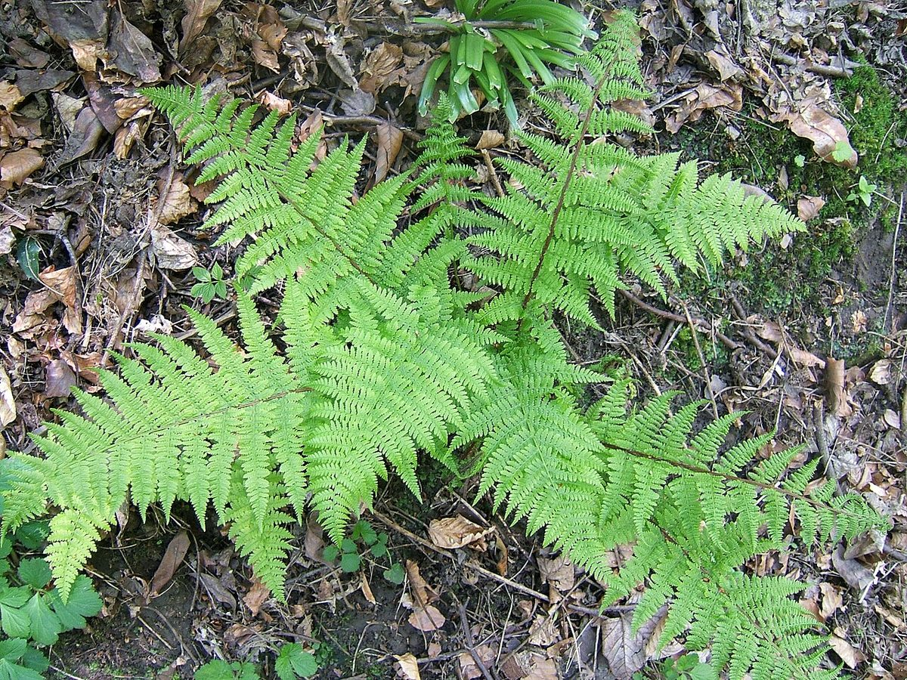
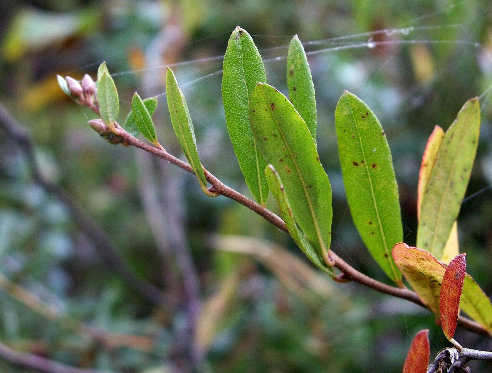
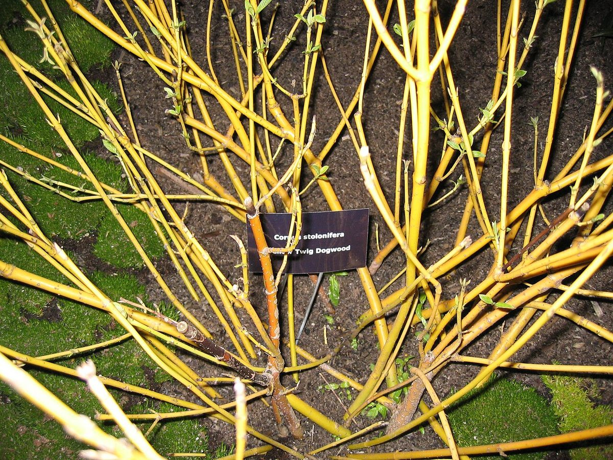
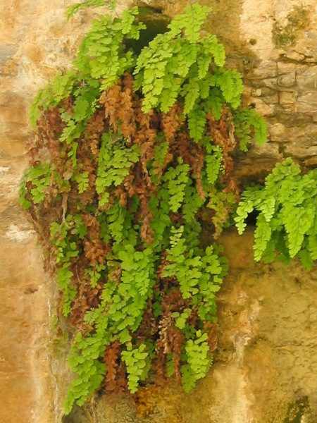
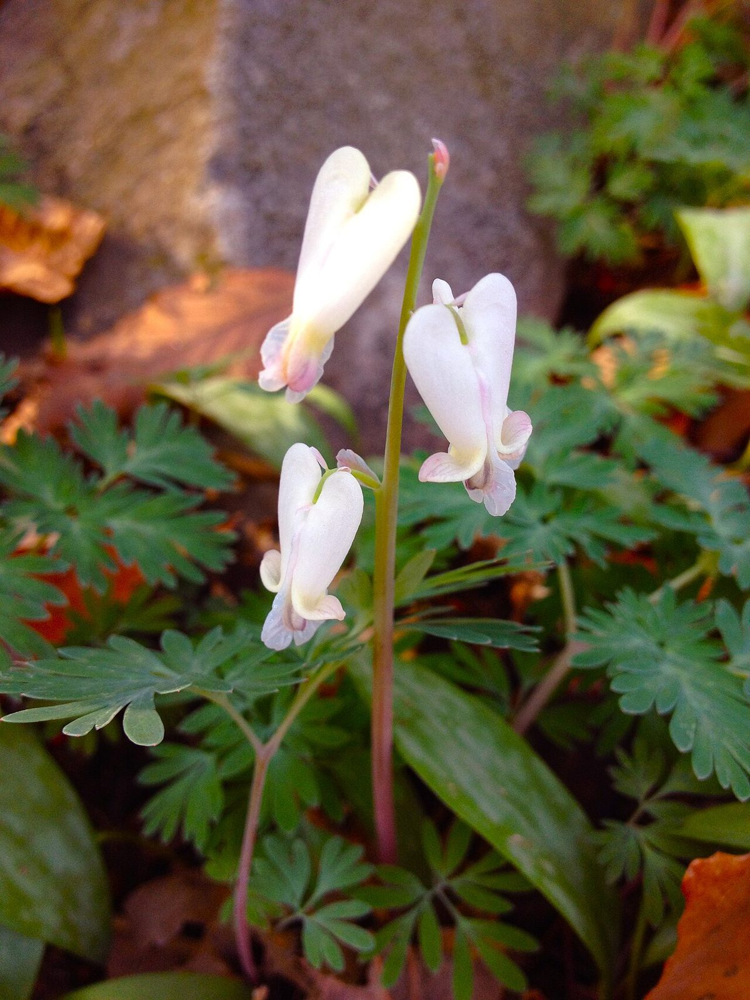
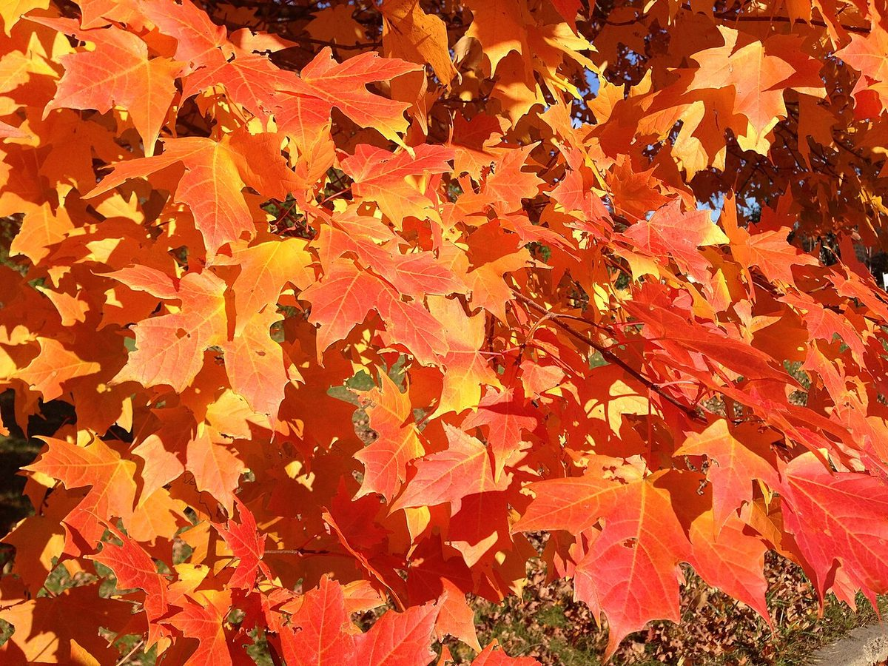
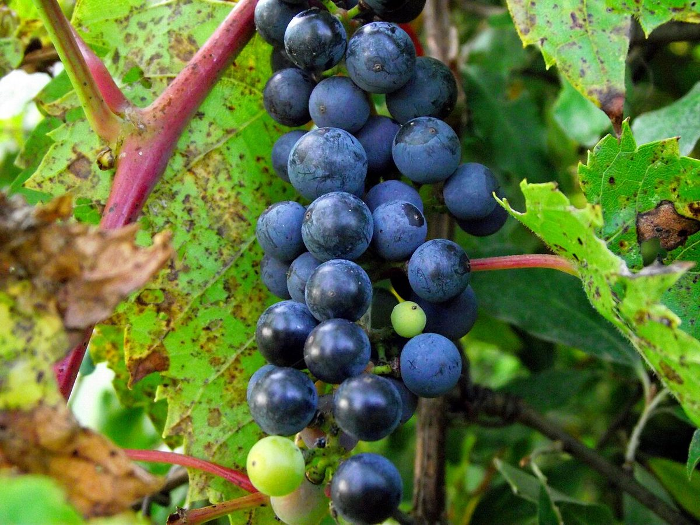

# Minnesota Native Plant Gallery

Click any plant to see photos, growing conditions, and the chapters that mention it.

_90 species in this gallery._

## All Species

| Plant | Scientific Name | Mentioned In |
|-------|-----------------|--------------|
| [Big Bluestem](big-bluestem.md) | *Andropogon gerardii* | 03, 05 |
| [Black Ash](black-ash.md) | *Fraxinus nigra* | 02, 08 |
| [Black-Eyed Susan](black-eyed-susan.md) | *Rudbeckia hirta* | 06 |
| [Blazing Star](blazing-star.md) | *Liatris ligulistylis* | 06, 10 |
| [Bloodroot](bloodroot.md) | *Sanguinaria canadensis* | 04, 10 |
| [Blue Flag Iris](blue-flag-iris.md) | *Iris versicolor* | 02, 05 |
| [Blue Joint Grass](blue-joint-grass.md) | *Calamagrostis canadensis* | 05 |
| [Boneset](boneset.md) | *Eupatorium perfoliatum* | 05 |
| [Broad-Leaved Cattail](broad-leaved-cattail.md) | *Typha latifolia* | 07 |
| [Bur Oak](bur-oak.md) | *Quercus macrocarpa* | 02 |
| [Butterfly Milkweed](butterfly-milkweed.md) | *Asclepias tuberosa* | 02, 06, 10, 11 |
| [Cardinal Flower](cardinal-flower.md) | *Lobelia cardinalis* | 06 |
| [Christmas Fern](christmas-fern.md) | *Polystichum acrostichoides* | 04 |
| [Common Buckthorn](common-buckthorn.md) | *Rhamnus cathartica* | 09 |
| [Common Milkweed](common-milkweed.md) | *Asclepias syriaca* | 06 |
| [Common Ragweed](common-ragweed.md) | *Ambrosia artemisiifolia* | 03 |
| [Cream Gentian](cream-gentian.md) | *Gentiana alba* | 06 |
| [Cup Plant](cup-plant.md) | *Silphium perfoliatum* | 06, 10 |
| [Dutchman's Breeches](dutchmans-breeches.md) | *Dicentra cucullaria* | 04 |
| [Elderberry](elderberry.md) | *Sambucus canadensis* | 05 |
| [Emerald Ash Borer](emerald-ash-borer.md) | *Agrilus planipennis* | 08 |
| [Evening Primrose](evening-primrose.md) | *Oenothera biennis* | 06 |
| [False Solomon's Seal](false-solomons-seal.md) | *Maianthemum racemosum* | 04 |
| [Garlic Mustard](garlic-mustard.md) | *Alliaria petiolata* | 09 |
| [Glossy Buckthorn](glossy-buckthorn.md) | *Frangula alnus* | 08 |
| [Golden Alexanders](golden-alexanders.md) | *Zizia aurea* | 06, 07, 10 |
| [Great Blue Lobelia](great-blue-lobelia.md) | *Lobelia siphilitica* | 05, 06, 10 |
| [Green Ash](green-ash.md) | *Fraxinus pennsylvanica* | 08 |
| [Indian Grass](indian-grass.md) | *Sorghastrum nutans* | 03 |
| [Ironweed](ironweed.md) | *Vernonia fasciculata* | 06 |
| [Jack-in-the-Pulpit](jack-in-the-pulpit.md) | *Arisaema triphyllum* | 04, 06 |
| [Japanese Barberry](japanese-barberry.md) | *Berberis thunbergii* | 08 |
| [Joe Pye Weed](joe-pye-weed.md) | *Eutrochium maculatum* | 05, 06 |
| [Kentucky Bluegrass](kentucky-bluegrass.md) | *Poa pratensis* | 03 |
| [Labrador Tea](labrador-tea.md) | *Rhododendron groenlandicum* | 05 |
| [Lady Fern](lady-fern.md) | *Athyrium filix-femina* | 04 |
| [Large-flowered Trillium](large-flowered-trillium.md) | *Trillium grandiflorum* | 04 |
| [Lead Plant](lead-plant.md) | *Amorpha canescens* | 06 |
| [Leafy Spurge](leafy-spurge.md) | *Euphorbia esula* | 08 |
| [Leatherleaf](leatherleaf.md) | *Chamaedaphne calyculata* | 05 |
| [Little Bluestem](little-bluestem.md) | *Schizachyrium scoparium* | 03 |
| [Maidenhair Fern](maidenhair-fern.md) | *Adiantum pedatum* | 04 |
| [Narrow-Leaved Cattail](narrow-leaved-cattail.md) | *Typha angustifolia* | 07 |
| [New England Aster](new-england-aster.md) | *Symphyotrichum novae-angliae* | 06 |
| [Northern White Cedar](northern-white-cedar.md) | *Thuja occidentalis* | 02 |
| [Oriental Bittersweet](oriental-bittersweet.md) | *Celastrus orbiculatus* | 04 |
| [Ostrich Fern](ostrich-fern.md) | *Matteuccia struthiopteris* | 04 |
| [Pale Purple Coneflower](pale-purple-coneflower.md) | *Echinacea pallida* | 03 |
| [Pasque Flower](pasque-flower.md) | *Anemone patens* | 02, 06 |
| [Poison Ivy](poison-ivy.md) | *Toxicodendron radicans* | 04 |
| [Porcelain Berry](porcelain-berry.md) | *Ampelopsis brevipedunculata* | 07 |
| [Prairie Dropseed](prairie-dropseed.md) | *Sporobolus heterolepis* | 03 |
| [Purple Coneflower](purple-coneflower.md) | *Echinacea purpurea* | 06 |
| [Purple Loosestrife](purple-loosestrife.md) | *Lythrum salicaria* | 08 |
| [Purple Prairie Clover](purple-prairie-clover.md) | *Dalea purpurea* | 03 |
| [Red-osier Dogwood](red-osier-dogwood.md) | *Cornus sericea* | 05 |
| [Reed Canary Grass](reed-canary-grass.md) | *Phalaris arundinacea* | 08 |
| [Sensitive Fern](sensitive-fern.md) | *Onoclea sensibilis* | 04 |
| [Showy Goldenrod](showy-goldenrod.md) | *Solidago speciosa* | 06 |
| [Silver Maple](silver-maple.md) | *Acer saccharinum* | 02, 05 |
| [Smooth Blue Aster](smooth-blue-aster.md) | *Symphyotrichum laeve* | 06, 10 |
| [Smooth Brome](smooth-brome.md) | *Bromus inermis* | 03 |
| [Solomon's Seal](solomons-seal.md) | *Polygonatum biflorum* | 04 |
| [Southern Maidenhair](southern-maidenhair.md) | *Adiantum capillus-veneris* | 04 |
| [Spiderwort](spiderwort.md) | *Tradescantia ohiensis* | 06 |
| [Spotted Knapweed](spotted-knapweed.md) | *Centaurea stoebe* | 08 |
| [Squirrel Corn](squirrel-corn.md) | *Dicentra canadensis* | 04 |
| [Stiff Goldenrod](stiff-goldenrod.md) | *Solidago rigida* | 06 |
| [Sugar maples](sugar-maples.md) | *Acer saccharum* | 13 |
| [Swamp Milkweed](swamp-milkweed.md) | *Asclepias incarnata* | 02, 05 |
| [Swamp White Oak](swamp-white-oak.md) | *Quercus bicolor* | 05 |
| [Switchgrass](switchgrass.md) | *Panicum virgatum* | 03, 05 |
| [Tamarack](tamarack.md) | *Larix laricina* | 02, 05 |
| [The Monarch Butterfly](the-monarch-butterfly.md) | *Danaus plexippus* | 06 |
| [Topeka Purple Coneflower](topeka-purple-coneflower.md) | *Echinacea atrorubens* | 03 |
| [Tussock Sedge](tussock-sedge.md) | *Carex stricta* | 05 |
| [Virginia Bluebells](virginia-bluebells.md) | *Mertensia virginica* | 06 |
| [White Ash](white-ash.md) | *Fraxinus americana* | 08 |
| [White Pine](white-pine.md) | *Pinus strobus* | 04 |
| [White Prairie Clover](white-prairie-clover.md) | *Dalea candida* | 03 |
| [White Turtlehead](white-turtlehead.md) | *Chelone glabra* | 06 |
| [Wild Bergamot](wild-bergamot.md) | *Monarda fistulosa* | 06 |
| [Wild Celery](wild-celery.md) | *Vallisneria americana* | 05 |
| [Wild Columbine](wild-columbine.md) | *Aquilegia canadensis* | 06 |
| [Wild Ginger](wild-ginger.md) | *Asarum canadense* | 04, 06 |
| [Wild Grape](wild-grape.md) | *Vitis riparia* | 07 |
| [Wild Lupine](wild-lupine.md) | *Lupinus perennis* | 06 |
| [Wild Parsnip](wild-parsnip.md) | *Pastinaca sativa* | 07, 08 |
| [Wild Rice](wild-rice.md) | *Zizania palustris* | 05 |
| [Wild Rose](wild-rose.md) | *Rosa blanda* | 06 |

## Visual Gallery

<a href="big-bluestem.md" class="plant-gallery-card">
Big Bluestem <em>Andropogon gerardii</em>
</a>
<a href="black-ash.md" class="plant-gallery-card">
Black Ash <em>Fraxinus nigra</em>
</a>
<a href="black-eyed-susan.md" class="plant-gallery-card">
Black-Eyed Susan <em>Rudbeckia hirta</em>
</a>
<a href="blazing-star.md" class="plant-gallery-card">
Blazing Star <em>Liatris ligulistylis</em>
</a>
<a href="bloodroot.md" class="plant-gallery-card">
Bloodroot <em>Sanguinaria canadensis</em>
</a>
<a href="blue-flag-iris.md" class="plant-gallery-card">
Blue Flag Iris <em>Iris versicolor</em>
</a>
<a href="blue-joint-grass.md" class="plant-gallery-card">
Blue Joint Grass <em>Calamagrostis canadensis</em>
</a>
<a href="boneset.md" class="plant-gallery-card">
Boneset <em>Eupatorium perfoliatum</em>
</a>
<a href="broad-leaved-cattail.md" class="plant-gallery-card">
Broad-Leaved Cattail <em>Typha latifolia</em>
</a>
<a href="bur-oak.md" class="plant-gallery-card">
Bur Oak <em>Quercus macrocarpa</em>
</a>
<a href="butterfly-milkweed.md" class="plant-gallery-card">
Butterfly Milkweed <em>Asclepias tuberosa</em>
</a>
<a href="cardinal-flower.md" class="plant-gallery-card">
Cardinal Flower <em>Lobelia cardinalis</em>
</a>
<a href="christmas-fern.md" class="plant-gallery-card">
Christmas Fern <em>Polystichum acrostichoides</em>
</a>
<a href="common-buckthorn.md" class="plant-gallery-card">
Common Buckthorn <em>Rhamnus cathartica</em>
</a>
<a href="common-milkweed.md" class="plant-gallery-card">
Common Milkweed <em>Asclepias syriaca</em>
</a>
<a href="common-ragweed.md" class="plant-gallery-card">
Common Ragweed <em>Ambrosia artemisiifolia</em>
</a>
<a href="cream-gentian.md" class="plant-gallery-card">
Cream Gentian <em>Gentiana alba</em>
</a>
<a href="cup-plant.md" class="plant-gallery-card">
Cup Plant <em>Silphium perfoliatum</em>
</a>
<a href="dutchmans-breeches.md" class="plant-gallery-card">
Dutchman's Breeches <em>Dicentra cucullaria</em>
</a>
<a href="elderberry.md" class="plant-gallery-card">
Elderberry <em>Sambucus canadensis</em>
</a>
<a href="emerald-ash-borer.md" class="plant-gallery-card">
Emerald Ash Borer <em>Agrilus planipennis</em>
</a>
<a href="evening-primrose.md" class="plant-gallery-card">
Evening Primrose <em>Oenothera biennis</em>
</a>
<a href="false-solomons-seal.md" class="plant-gallery-card">
False Solomon's Seal <em>Maianthemum racemosum</em>
</a>
<a href="garlic-mustard.md" class="plant-gallery-card">
Garlic Mustard <em>Alliaria petiolata</em>
</a>
<a href="glossy-buckthorn.md" class="plant-gallery-card">
Glossy Buckthorn <em>Frangula alnus</em>
</a>
<a href="golden-alexanders.md" class="plant-gallery-card">
Golden Alexanders <em>Zizia aurea</em>
</a>
<a href="great-blue-lobelia.md" class="plant-gallery-card">
Great Blue Lobelia <em>Lobelia siphilitica</em>
</a>
<a href="green-ash.md" class="plant-gallery-card">
Green Ash <em>Fraxinus pennsylvanica</em>
</a>
<a href="indian-grass.md" class="plant-gallery-card">
Indian Grass <em>Sorghastrum nutans</em>
</a>
<a href="ironweed.md" class="plant-gallery-card">
Ironweed <em>Vernonia fasciculata</em>
</a>
<a href="jack-in-the-pulpit.md" class="plant-gallery-card">
Jack-in-the-Pulpit <em>Arisaema triphyllum</em>
</a>
<a href="japanese-barberry.md" class="plant-gallery-card">
Japanese Barberry <em>Berberis thunbergii</em>
</a>
<a href="joe-pye-weed.md" class="plant-gallery-card">
Joe Pye Weed <em>Eutrochium maculatum</em>
</a>
<a href="kentucky-bluegrass.md" class="plant-gallery-card">
Kentucky Bluegrass <em>Poa pratensis</em>
</a>
<a href="labrador-tea.md" class="plant-gallery-card">
Labrador Tea <em>Rhododendron groenlandicum</em>
</a>
<a href="lady-fern.md" class="plant-gallery-card">
Lady Fern <em>Athyrium filix-femina</em>
</a>
<a href="large-flowered-trillium.md" class="plant-gallery-card">
Large-flowered Trillium <em>Trillium grandiflorum</em>
</a>
<a href="lead-plant.md" class="plant-gallery-card">
Lead Plant <em>Amorpha canescens</em>
</a>
<a href="leafy-spurge.md" class="plant-gallery-card">
Leafy Spurge <em>Euphorbia esula</em>
</a>
<a href="leatherleaf.md" class="plant-gallery-card">
Leatherleaf <em>Chamaedaphne calyculata</em>
</a>
<a href="little-bluestem.md" class="plant-gallery-card">
Little Bluestem <em>Schizachyrium scoparium</em>
</a>
<a href="maidenhair-fern.md" class="plant-gallery-card">
Maidenhair Fern <em>Adiantum pedatum</em>
</a>
<a href="narrow-leaved-cattail.md" class="plant-gallery-card">
Narrow-Leaved Cattail <em>Typha angustifolia</em>
</a>
<a href="new-england-aster.md" class="plant-gallery-card">
New England Aster <em>Symphyotrichum novae-angliae</em>
</a>
<a href="northern-white-cedar.md" class="plant-gallery-card">
Northern White Cedar <em>Thuja occidentalis</em>
</a>
<a href="oriental-bittersweet.md" class="plant-gallery-card">
Oriental Bittersweet <em>Celastrus orbiculatus</em>
</a>
<a href="ostrich-fern.md" class="plant-gallery-card">
Ostrich Fern <em>Matteuccia struthiopteris</em>
</a>
<a href="pale-purple-coneflower.md" class="plant-gallery-card">
Pale Purple Coneflower <em>Echinacea pallida</em>
</a>
<a href="pasque-flower.md" class="plant-gallery-card">
Pasque Flower <em>Anemone patens</em>
</a>
<a href="poison-ivy.md" class="plant-gallery-card">
Poison Ivy <em>Toxicodendron radicans</em>
</a>
<a href="porcelain-berry.md" class="plant-gallery-card">
Porcelain Berry <em>Ampelopsis brevipedunculata</em>
</a>
<a href="prairie-dropseed.md" class="plant-gallery-card">
Prairie Dropseed <em>Sporobolus heterolepis</em>
</a>
<a href="purple-coneflower.md" class="plant-gallery-card">
Purple Coneflower <em>Echinacea purpurea</em>
</a>
<a href="purple-loosestrife.md" class="plant-gallery-card">
Purple Loosestrife <em>Lythrum salicaria</em>
</a>
<a href="purple-prairie-clover.md" class="plant-gallery-card">
Purple Prairie Clover <em>Dalea purpurea</em>
</a>
<a href="red-osier-dogwood.md" class="plant-gallery-card">
Red-osier Dogwood <em>Cornus sericea</em>
</a>
<a href="sensitive-fern.md" class="plant-gallery-card">
Sensitive Fern <em>Onoclea sensibilis</em>
</a>
<a href="showy-goldenrod.md" class="plant-gallery-card">
Showy Goldenrod <em>Solidago speciosa</em>
</a>
<a href="silver-maple.md" class="plant-gallery-card">
Silver Maple <em>Acer saccharinum</em>
</a>
<a href="smooth-blue-aster.md" class="plant-gallery-card">
Smooth Blue Aster <em>Symphyotrichum laeve</em>
</a>
<a href="smooth-brome.md" class="plant-gallery-card">
Smooth Brome <em>Bromus inermis</em>
</a>
<a href="solomons-seal.md" class="plant-gallery-card">
Solomon's Seal <em>Polygonatum biflorum</em>
</a>
<a href="southern-maidenhair.md" class="plant-gallery-card">
Southern Maidenhair <em>Adiantum capillus-veneris</em>
</a>
<a href="spiderwort.md" class="plant-gallery-card">
Spiderwort <em>Tradescantia ohiensis</em>
</a>
<a href="spotted-knapweed.md" class="plant-gallery-card">
Spotted Knapweed <em>Centaurea stoebe</em>
</a>
<a href="squirrel-corn.md" class="plant-gallery-card">
Squirrel Corn <em>Dicentra canadensis</em>
</a>
<a href="stiff-goldenrod.md" class="plant-gallery-card">
Stiff Goldenrod <em>Solidago rigida</em>
</a>
<a href="sugar-maples.md" class="plant-gallery-card">
Sugar maples <em>Acer saccharum</em>
</a>
<a href="swamp-milkweed.md" class="plant-gallery-card">
Swamp Milkweed <em>Asclepias incarnata</em>
</a>
<a href="swamp-white-oak.md" class="plant-gallery-card">
Swamp White Oak <em>Quercus bicolor</em>
</a>
<a href="switchgrass.md" class="plant-gallery-card">
Switchgrass <em>Panicum virgatum</em>
</a>
<a href="tamarack.md" class="plant-gallery-card">
Tamarack <em>Larix laricina</em>
</a>
<a href="the-monarch-butterfly.md" class="plant-gallery-card">
The Monarch Butterfly <em>Danaus plexippus</em>
</a>
<a href="topeka-purple-coneflower.md" class="plant-gallery-card">
Topeka Purple Coneflower <em>Echinacea atrorubens</em>
</a>
<a href="tussock-sedge.md" class="plant-gallery-card">
Tussock Sedge <em>Carex stricta</em>
</a>
<a href="virginia-bluebells.md" class="plant-gallery-card">
Virginia Bluebells <em>Mertensia virginica</em>
</a>
<a href="white-ash.md" class="plant-gallery-card">
White Ash <em>Fraxinus americana</em>
</a>
<a href="white-pine.md" class="plant-gallery-card">
White Pine <em>Pinus strobus</em>
</a>
<a href="white-prairie-clover.md" class="plant-gallery-card">
White Prairie Clover <em>Dalea candida</em>
</a>
<a href="white-turtlehead.md" class="plant-gallery-card">
White Turtlehead <em>Chelone glabra</em>
</a>
<a href="wild-bergamot.md" class="plant-gallery-card">
Wild Bergamot <em>Monarda fistulosa</em>
</a>
<a href="wild-celery.md" class="plant-gallery-card">
Wild Celery <em>Vallisneria americana</em>
</a>
<a href="wild-columbine.md" class="plant-gallery-card">
Wild Columbine <em>Aquilegia canadensis</em>
</a>
<a href="wild-ginger.md" class="plant-gallery-card">
Wild Ginger <em>Asarum canadense</em>
</a>
<a href="wild-grape.md" class="plant-gallery-card">
Wild Grape <em>Vitis riparia</em>
</a>
<a href="wild-lupine.md" class="plant-gallery-card">
Wild Lupine <em>Lupinus perennis</em>
</a>
<a href="wild-parsnip.md" class="plant-gallery-card">
Wild Parsnip <em>Pastinaca sativa</em>
</a>
<a href="wild-rice.md" class="plant-gallery-card">
Wild Rice <em>Zizania palustris</em>
</a>
<a href="wild-rose.md" class="plant-gallery-card">
Wild Rose <em>Rosa blanda</em>
</a>

