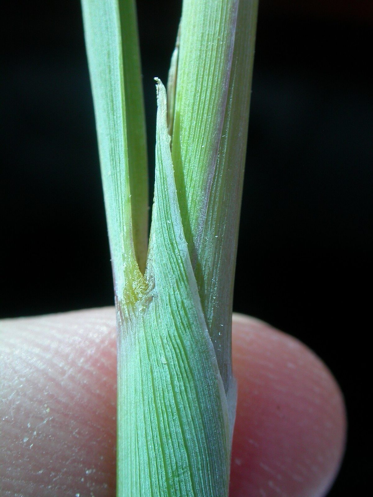

# Indian Grass

*Sorghastrum nutans*

Sorghastrum nutans,  known as Indiangrass, is a North American prairie grass found in the United States and Canada, especially in the Great Plains and tallgrass prairies. It is sometimes called Indian grass, yellow Indian-grass, or wood grass.

## Quick Facts

| | |
|---|---|
| **Scientific name** | *Sorghastrum nutans* |
| **Family** | — |
| **Height** | — |
| **Bloom time** | — |
| **Sun** | — |
| **Moisture** | — |
| **Soil** | — |
| **Wildlife value** | — |

## Mentioned In

- [Prairie Plants Grasslands](../chapters/03-prairie-plants-grasslands/index.md)

## Image Credits

- Chhe (talk) (Public domain)
- Matt Lavin from Bozeman, Montana, USA (CC BY-SA 2.0)

## Learn More

- [Wikipedia: Sorghastrum nutans](https://en.wikipedia.org/wiki/Sorghastrum_nutans)
