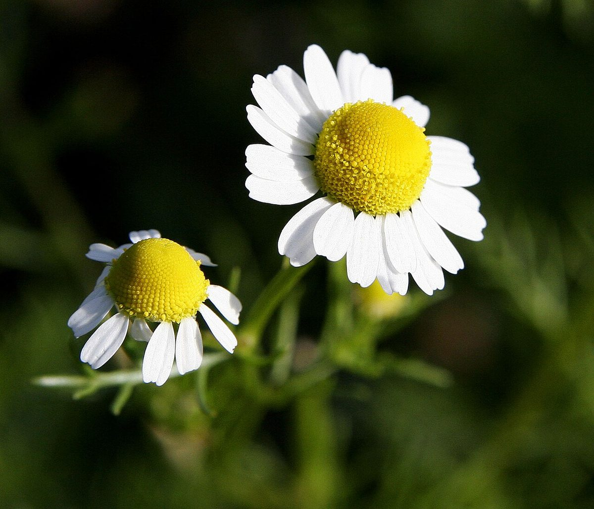

# Ironweed

*Vernonia fasciculata*

Vernonia fasciculata, the smooth ironweed or common ironweed, or prairie ironweed is a species of perennial plant in the family Asteraceae. It is native to Manitoba in Canada and the north-central U.S.A.
Vernonia fasciculata inhabits areas with moist soils and prairies. It flowers in July to September.

## Quick Facts

| | |
|---|---|
| **Scientific name** | *Vernonia fasciculata* |
| **Family** | — |
| **Height** | — |
| **Bloom time** | — |
| **Sun** | — |
| **Moisture** | — |
| **Soil** | — |
| **Wildlife value** | — |

## Mentioned In

- [Pollinators Wildlife](../chapters/06-pollinators-wildlife/index.md)

## Image Credits

- Fir0002 20D (GFDL 1.2)

## Learn More

- [Wikipedia: Vernonia fasciculata](https://en.wikipedia.org/wiki/Vernonia_fasciculata)
