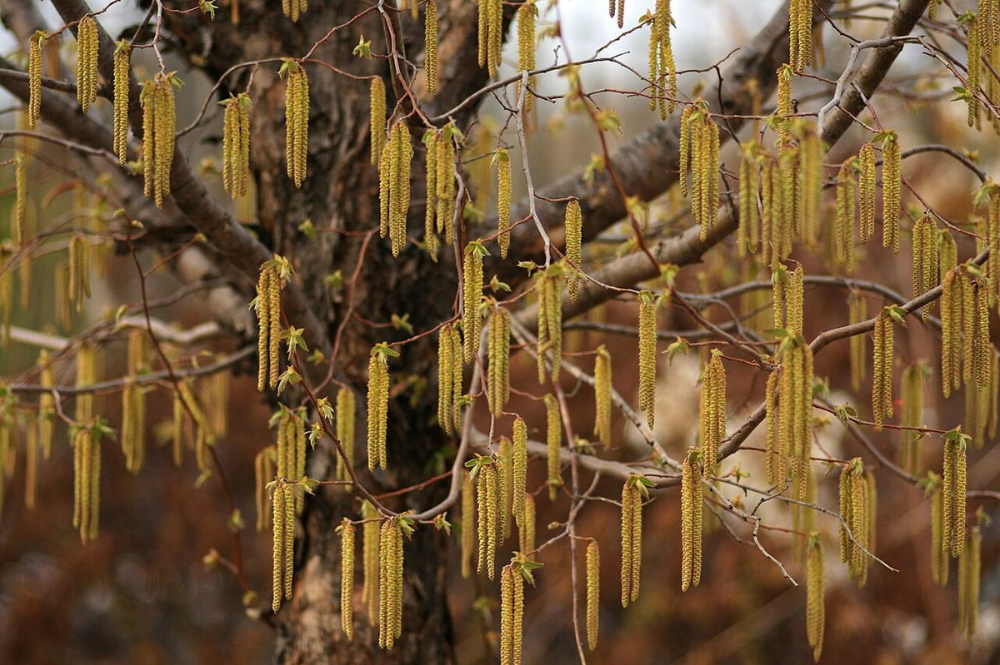

# Ironwood

*Ostrya virginiana*

Ostrya virginiana, the American hophornbeam, is a species of Ostrya native to eastern North America, from Nova Scotia west to southern Manitoba and eastern Wyoming, southeast to northern Florida and southwest to eastern Texas. Populations from Mexico and Central America are also regarded as the same species, although some authors prefer to separate them as a distinct species, Ostrya guatemalensis. Other names include eastern hophornbeam, hardhack (in New England), ironwood, and leverwood.

## Quick Facts

| | |
|---|---|
| **Scientific name** | *Ostrya virginiana* |
| **Family** | — |
| **Height** | — |
| **Bloom time** | — |
| **Sun** | — |
| **Moisture** | — |
| **Soil** | — |
| **Wildlife value** | — |

## Mentioned In

- [Ecoregions Growing Conditions](../chapters/02-ecoregions-growing-conditions/index.md)
- [Woodland Forest Plants](../chapters/04-woodland-forest-plants/index.md)
- [Plant Identification Skills](../chapters/07-plant-identification-skills/index.md)

## Image Credits

- Katja Schulz from Washington, D. C., USA (CC BY 2.0)
- Katja Schulz from Washington, D. C., USA (CC BY 2.0)

## Learn More

- [Wikipedia: Ostrya virginiana](https://en.wikipedia.org/wiki/Ostrya_virginiana)
