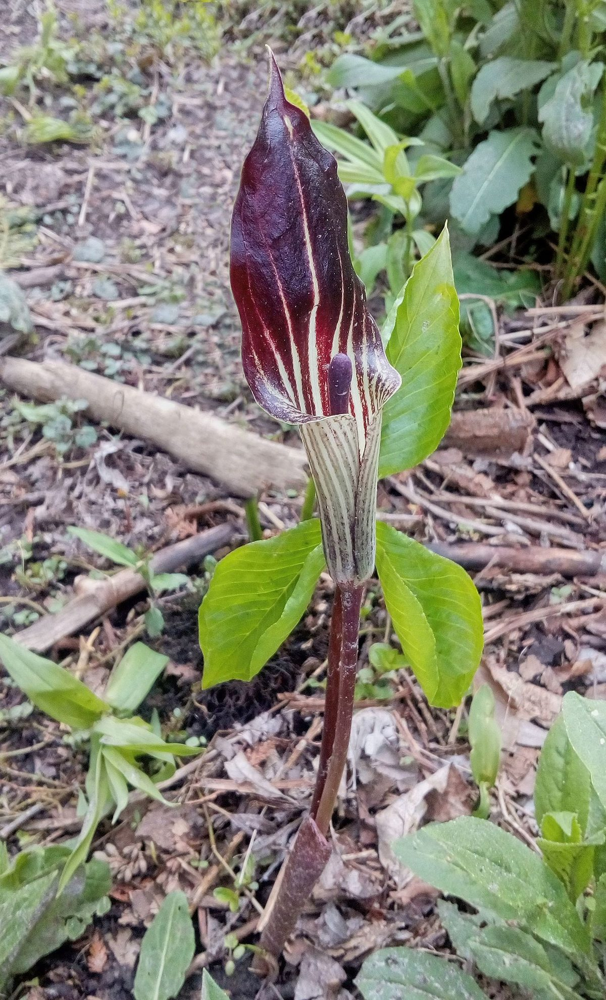

# Jack-in-the-Pulpit

*Arisaema triphyllum*

Arisaema triphyllum, the Jack-in-the-pulpit, is a species of flowering plant in the arum family Araceae. It is a member of the Arisaema triphyllum complex, a group of four or five closely related taxa in eastern North America. The specific name triphyllum means "three-leaved", a characteristic feature of the species, which is also referred to as Indian turnip, bog onion, and brown dragon.

## Quick Facts

| | |
|---|---|
| **Scientific name** | *Arisaema triphyllum* |
| **Family** | — |
| **Height** | — |
| **Bloom time** | — |
| **Sun** | — |
| **Moisture** | — |
| **Soil** | — |
| **Wildlife value** | — |

## Mentioned In

- [Woodland Forest Plants](../chapters/04-woodland-forest-plants/index.md)
- [Pollinators Wildlife](../chapters/06-pollinators-wildlife/index.md)

## Image Credits

- Geoffrey.landis (CC BY-SA 4.0)
- СССР (CC BY-SA 2.5 ca)

## Learn More

- [Wikipedia: Arisaema triphyllum](https://en.wikipedia.org/wiki/Arisaema_triphyllum)
