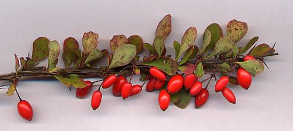
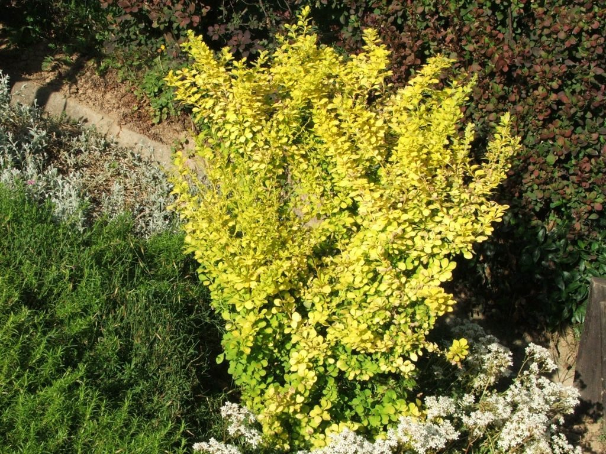

# Japanese Barberry

*Berberis thunbergii*

Berberis thunbergii, the Japanese barberry, Thunberg's barberry, or red barberry, is a species of flowering plant in the barberry family Berberidaceae, native to Japan and eastern Asia, though widely naturalized in China and North America, where it has become a problematic invasive in many places, leading to declines in species diversity, increased tick habitat, and soil changes. Growing to 1 m (3 ft 3 in) tall by 2.5 m (8 ft 2 in) broad, it is a small deciduous shrub with green leaves turning red in the autumn, brilliant red fruits in autumn and pale yellow flowers in spring.

## Quick Facts

| | |
|---|---|
| **Scientific name** | *Berberis thunbergii* |
| **Family** | — |
| **Height** | — |
| **Bloom time** | — |
| **Sun** | — |
| **Moisture** | — |
| **Soil** | — |
| **Wildlife value** | — |

## Mentioned In

- [Invasive Species Id](../chapters/08-invasive-species-id/index.md)

## Image Credits

- User:MPF (CC BY-SA 3.0)
- Jerzy Opioła (Poland) (CC BY-SA 3.0)

## Learn More

- [Wikipedia: Berberis thunbergii](https://en.wikipedia.org/wiki/Berberis_thunbergii)
