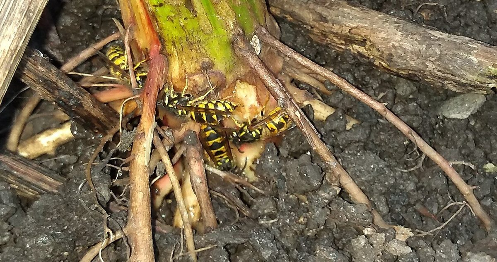
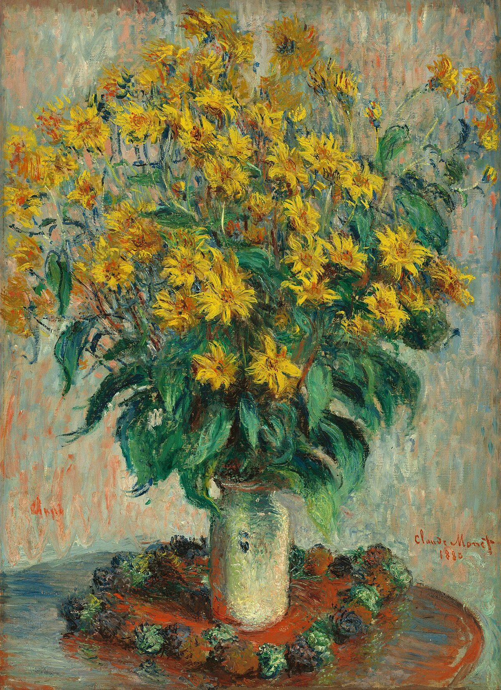

# Jerusalem Artichoke

*Helianthus tuberosus*

The Jerusalem artichoke (Helianthus tuberosus), also called sunroot, sunchoke, wild sunflower, topinambur, or earth apple, is a species of sunflower native to central North America. It is cultivated widely across the temperate zone for its tuber, which is used as a root vegetable.

## Quick Facts

| | |
|---|---|
| **Scientific name** | *Helianthus tuberosus* |
| **Family** | — |
| **Height** | — |
| **Bloom time** | — |
| **Sun** | — |
| **Moisture** | — |
| **Soil** | — |
| **Wildlife value** | — |

## Mentioned In

- [Cultural Indigenous Uses](../chapters/13-cultural-indigenous-uses/index.md)

## Image Credits

- Dianebees (CC BY-SA 4.0)
- Claude Monet (Public domain)

## Learn More

- [Wikipedia: Jerusalem artichoke](https://en.wikipedia.org/wiki/Jerusalem_artichoke)
