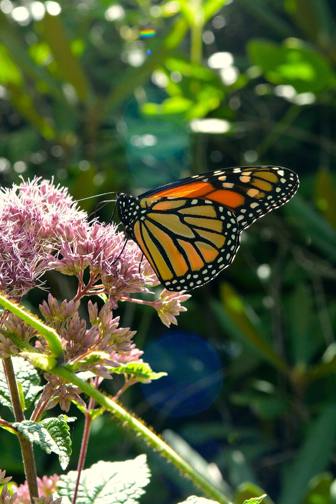
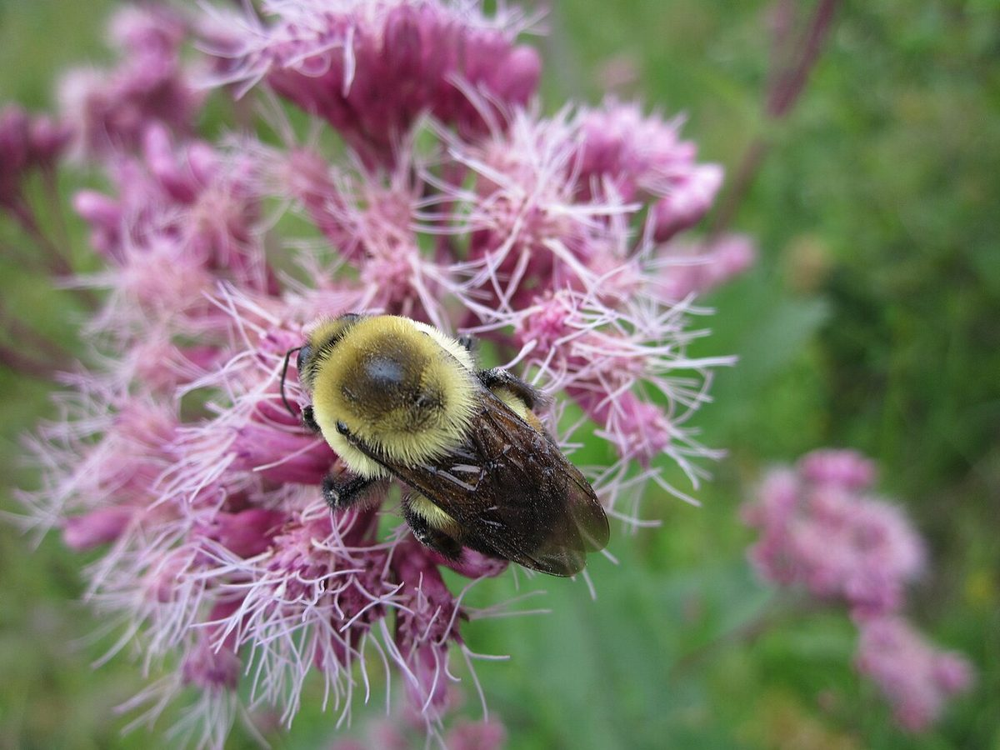

# Joe Pye Weed

*Eutrochium maculatum*

Eutrochium is a North American genus of herbaceous flowering plants in the family Asteraceae. They are commonly referred to as Joe-Pye weeds. They are native to the United States and Canada, and have non-dissected foliage and pigmented flowers.

## Quick Facts

| | |
|---|---|
| **Scientific name** | *Eutrochium maculatum* |
| **Family** | — |
| **Height** | — |
| **Bloom time** | — |
| **Sun** | — |
| **Moisture** | — |
| **Soil** | — |
| **Wildlife value** | — |

## Mentioned In

- [Wetland Shoreline Plants](../chapters/05-wetland-shoreline-plants/index.md)
- [Pollinators Wildlife](../chapters/06-pollinators-wildlife/index.md)

## Image Credits

- TIFFANYLAUFER (CC BY-SA 4.0)
- Seney Natural History Association (CC BY-SA 2.0)

## Learn More

- [Wikipedia: Eutrochium](https://en.wikipedia.org/wiki/Eutrochium)
