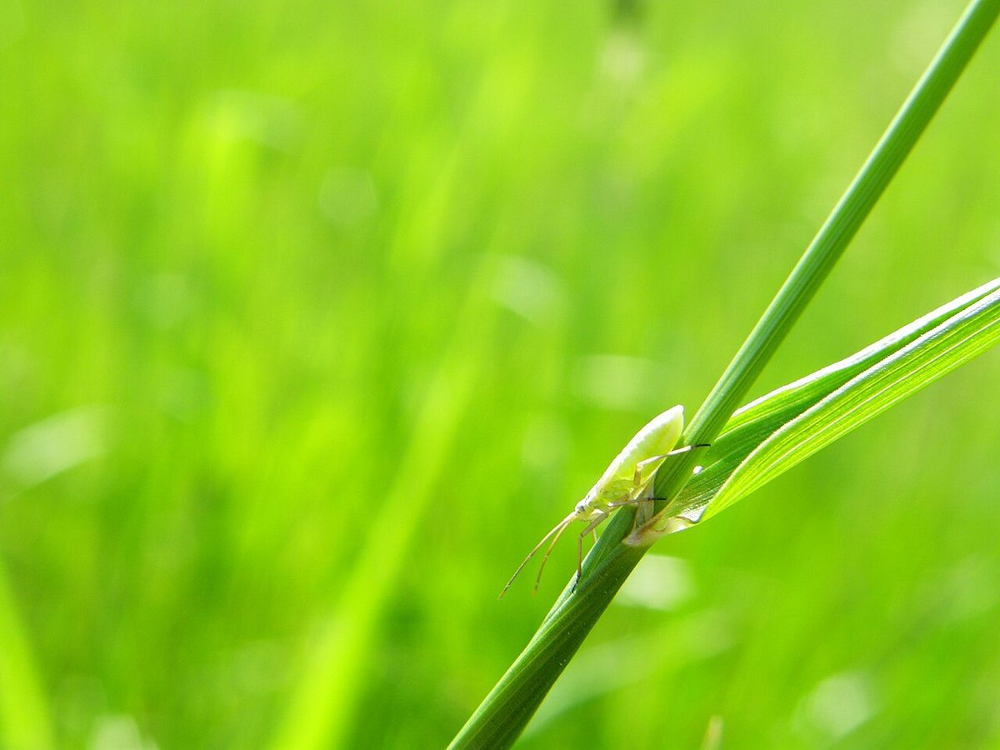
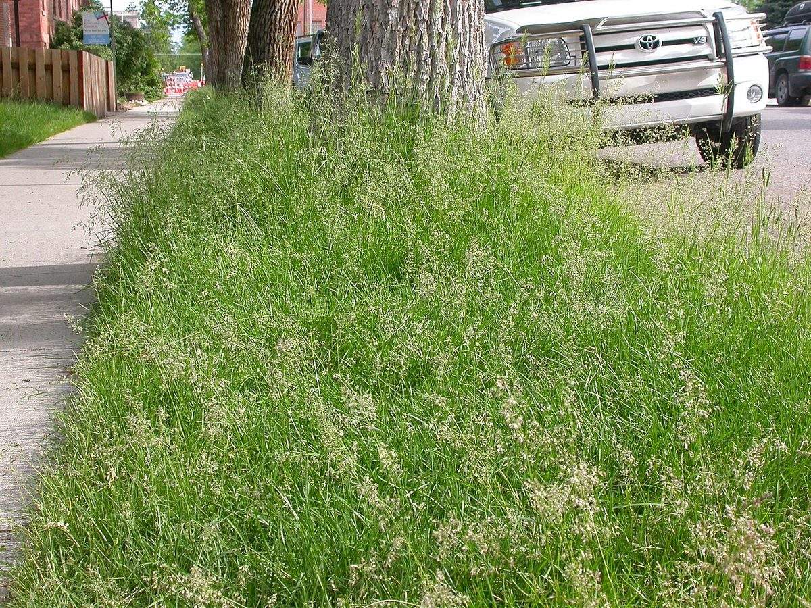

# Kentucky Bluegrass

*Poa pratensis*

Poa pratensis, commonly known as Kentucky bluegrass (or blue grass), smooth meadow-grass, or common meadow-grass, is a perennial species of grass native to practically all of Europe, North Asia and the mountains of Algeria, Morocco, and Tunisia. There is disagreement about its native status in North America, with some sources considering it native and others stating the Spanish Empire brought the seeds of Kentucky bluegrass to the New World in mixtures with other grasses. It is a common and incredibly popular lawn grass in North America with the species being spread over all of the cool, humid parts of the United States.

## Quick Facts

| | |
|---|---|
| **Scientific name** | *Poa pratensis* |
| **Family** | — |
| **Height** | — |
| **Bloom time** | — |
| **Sun** | — |
| **Moisture** | — |
| **Soil** | — |
| **Wildlife value** | — |

## Mentioned In

- [Prairie Plants Grasslands](../chapters/03-prairie-plants-grasslands/index.md)

## Image Credits

- Rigel7 (CC0)
- Matt Lavin from Bozeman, Montana, USA (CC BY-SA 2.0)

## Learn More

- [Wikipedia: Poa pratensis](https://en.wikipedia.org/wiki/Poa_pratensis)
