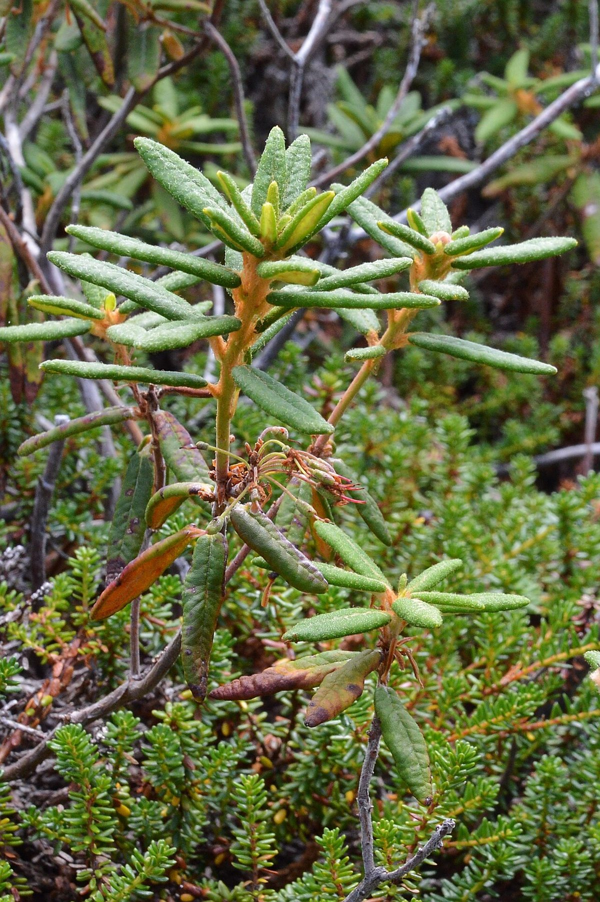

# Labrador Tea

*Rhododendron groenlandicum*

Rhododendron groenlandicum (formerly Ledum groenlandicum or Ledum latifolium), known by the common names bog Labrador tea, muskeg tea, swamp tea, in northern Canada, Hudson's Bay tea, and in Greenlandic, Qajaasaq (IPA: [qajaːsɑq], resembling a Kayak), is a species of flowering shrub in the family Ericaceae. Found in northern parts of North America and Greenland,  R. groenlandicum grows primarily in bogs and other wetlands, which tend to be also in cold, acidic, and nutrient-poor environments. It has traditionally been used to make medicinal herbal teas among the Dene, Athabaskan, and Inuit, and other indigenous cultures of North America peoples.

## Quick Facts

| | |
|---|---|
| **Scientific name** | *Rhododendron groenlandicum* |
| **Family** | — |
| **Height** | — |
| **Bloom time** | — |
| **Sun** | — |
| **Moisture** | — |
| **Soil** | — |
| **Wildlife value** | — |

## Mentioned In

- [Wetland Shoreline Plants](../chapters/05-wetland-shoreline-plants/index.md)

## Image Credits

- Jason Hollinger (CC BY 2.0)
- Ryan Hodnett (CC BY-SA 4.0)

## Learn More

- [Wikipedia: Rhododendron groenlandicum](https://en.wikipedia.org/wiki/Rhododendron_groenlandicum)
