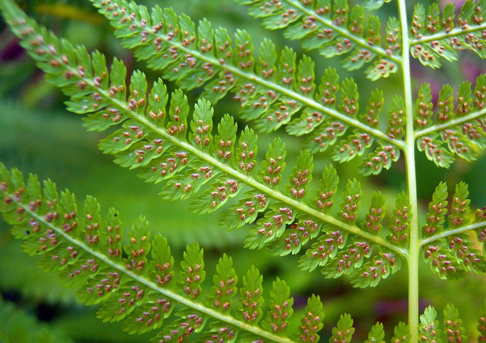

# Lady Fern

*Athyrium filix-femina*

Athyrium filix-femina, the lady fern or common lady-fern, is a large, feathery species of fern native to temperate Asia, Europe, and North Africa. It is often abundant (one of the more common ferns) in damp, shady woodland environments and is often grown for decoration.
Its common names "lady fern" and "female fern" refer to how its reproductive structures (sori) are concealed in an inconspicuous – deemed "female" – manner on the frond.

## Quick Facts

| | |
|---|---|
| **Scientific name** | *Athyrium filix-femina* |
| **Family** | — |
| **Height** | — |
| **Bloom time** | — |
| **Sun** | — |
| **Moisture** | — |
| **Soil** | — |
| **Wildlife value** | — |

## Mentioned In

- [Woodland Forest Plants](../chapters/04-woodland-forest-plants/index.md)

## Image Credits

- No machine-readable author provided. MPF assumed (based on copyright claims). (CC BY 2.5)
- MurielBendel (CC BY-SA 4.0)

## Learn More

- [Wikipedia: Athyrium filix-femina](https://en.wikipedia.org/wiki/Athyrium_filix-femina)
