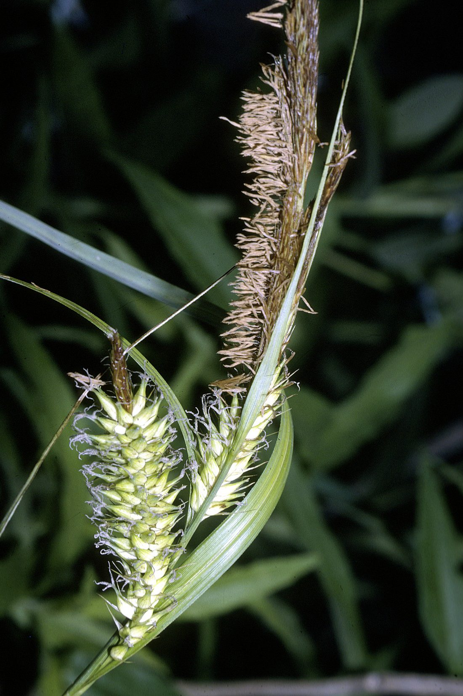

# Lake Sedge

*Carex lacustris*

Carex lacustris, known as lake sedge (lucastris is from the Latin lacus, or lake), is a tufted grass-like perennial of the sedge family (Cyperaceae), native to southern Canada and the northern United States. C. lacustris us an herbaceous surface-piercing plant that grows in water up to 50 cm (1.6 ft) deep, and grows 50–150 cm (1.6–4.9 ft) tall. It grows well in marshes and swampy woods of the boreal forest, along river and lake shores, in ditches, marshes, swamps, and other wetland habitat.

## Quick Facts

| | |
|---|---|
| **Scientific name** | *Carex lacustris* |
| **Family** | — |
| **Height** | — |
| **Bloom time** | — |
| **Sun** | — |
| **Moisture** | — |
| **Soil** | — |
| **Wildlife value** | — |

## Mentioned In

- [Ecological Restoration](../chapters/12-ecological-restoration/index.md)

## Image Credits

- Agyle (CC0)
- Robert H. Mohlenbrock. USDA NRCS. 1995. Northeast wetland flora: Field office guide to plant species. Northeast National Technical Center, Chester. Courtesy of USDA NRCS Wetland Science Institute. (Public domain)

## Learn More

- [Wikipedia: Carex lacustris](https://en.wikipedia.org/wiki/Carex_lacustris)
