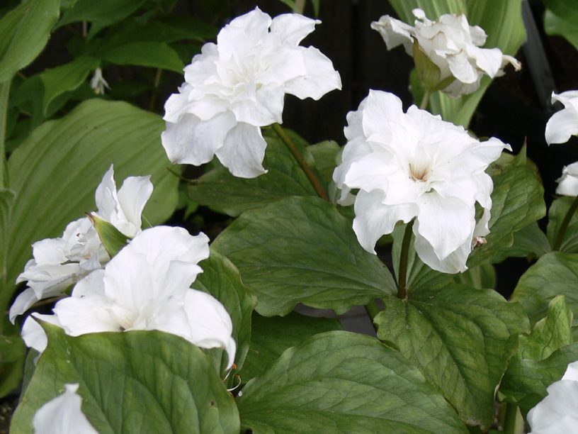
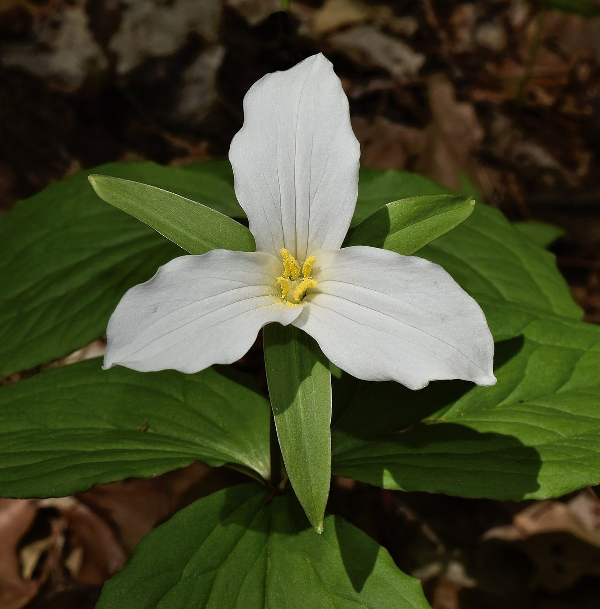

# Large-flowered Trillium

*Trillium grandiflorum*

Trillium grandiflorum, the white trillium, large-flowered trillium, great white trillium, white wake-robin or French: trille blanc, is a species of flowering plant in the family Melanthiaceae. A monocotyledonous, herbaceous perennial, the plant is native to eastern North America, from northern Quebec to the southern parts of the United States through the Appalachian Mountains into northernmost Georgia and west to Minnesota. There are also several isolated populations in Nova Scotia, Maine, southern Illinois, and Iowa.

## Quick Facts

| | |
|---|---|
| **Scientific name** | *Trillium grandiflorum* |
| **Family** | — |
| **Height** | — |
| **Bloom time** | — |
| **Sun** | — |
| **Moisture** | — |
| **Soil** | — |
| **Wildlife value** | — |

## Mentioned In

- [Woodland Forest Plants](../chapters/04-woodland-forest-plants/index.md)

## Image Credits

- Simon Garbutt. SiGarb 20:53, 4 December 2006 (UTC) (Public domain)
- СССР (CC BY-SA 2.5 ca)

## Learn More

- [Wikipedia: Trillium grandiflorum](https://en.wikipedia.org/wiki/Trillium_grandiflorum)
