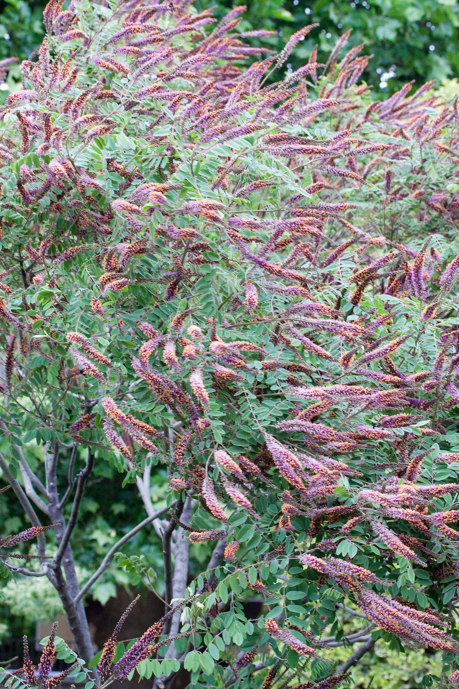

# Lead Plant

*Amorpha canescens*

Amorpha canescens, known as leadplant, downy indigo bush, prairie shoestring, or buffalo bellows, is a small, perennial semi-shrub in the pea family (Fabaceae), native to North America. It has very small purple flowers with yellow stamens which are grouped in racemes. Depending on location, the flowers bloom from late June through mid-September.

## Quick Facts

| | |
|---|---|
| **Scientific name** | *Amorpha canescens* |
| **Family** | — |
| **Height** | — |
| **Bloom time** | — |
| **Sun** | — |
| **Moisture** | — |
| **Soil** | — |
| **Wildlife value** | — |

## Mentioned In

- [Pollinators Wildlife](../chapters/06-pollinators-wildlife/index.md)

## Image Credits

- Denis.prévôt (CC BY-SA 3.0)

## Learn More

- [Wikipedia: Amorpha canescens](https://en.wikipedia.org/wiki/Amorpha_canescens)
