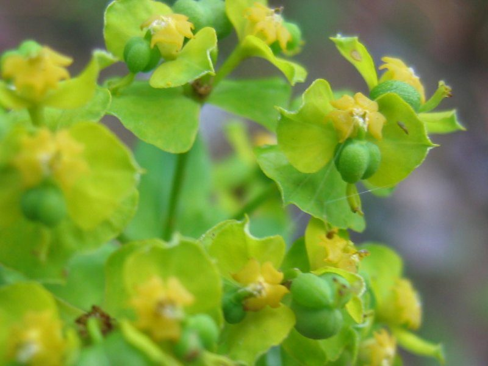

# Leafy Spurge

*Euphorbia esula*

Euphorbia esula, commonly known as green spurge or leafy spurge, is a species of spurge native to central and southern Europe (north to England, the Netherlands, and Germany), and eastward through most of Asia north of the Himalaya to Korea and eastern Siberia. It can also be found in some parts of Alaska.

## Quick Facts

| | |
|---|---|
| **Scientific name** | *Euphorbia esula* |
| **Family** | — |
| **Height** | — |
| **Bloom time** | — |
| **Sun** | — |
| **Moisture** | — |
| **Soil** | — |
| **Wildlife value** | — |

## Mentioned In

- [Invasive Species Id](../chapters/08-invasive-species-id/index.md)

## Image Credits

- Ivar Leidus (CC BY-SA 3.0)
- Kristian Peters -- Fabelfroh 13:02, 3 November 2005 (UTC) (CC BY-SA 3.0)

## Learn More

- [Wikipedia: Euphorbia esula](https://en.wikipedia.org/wiki/Euphorbia_esula)
