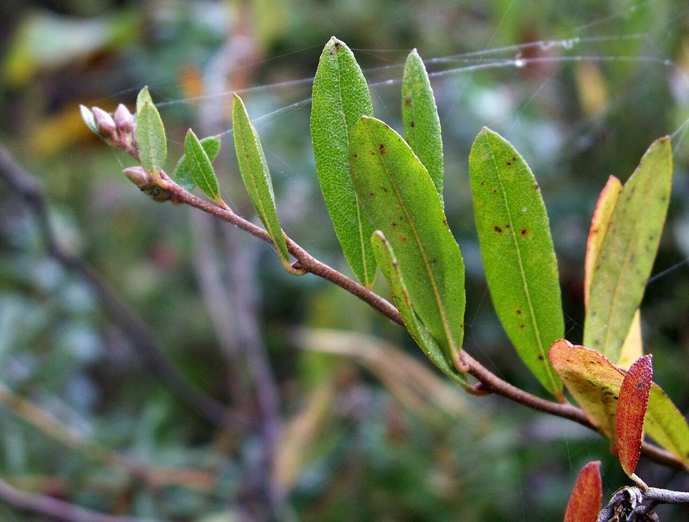

# Leatherleaf

*Chamaedaphne calyculata*

Chamaedaphne calyculata, known commonly as leatherleaf or cassandra, is a perennial dwarf shrub in the plant family Ericaceae and the only species in the genus Chamaedaphne. It is commonly seen in cold, acidic bogs and forms large, spreading colonies.

## Quick Facts

| | |
|---|---|
| **Scientific name** | *Chamaedaphne calyculata* |
| **Family** | Ericaceae |
| **Height** | 1-4 ft |
| **Bloom time** | Apr-May |
| **Sun** | Full sun |
| **Moisture** | Wet |
| **Soil** | Acidic peat |
| **Wildlife value** | Forms the floating bog mat; very early bloom for emerging queen bumble bees |

## Mentioned In

- [Wetland Shoreline Plants](../chapters/05-wetland-shoreline-plants/index.md)

## Image Credits

- bernd gliwa (CC BY-SA 2.5)

## Learn More

- [Wikipedia: Chamaedaphne](https://en.wikipedia.org/wiki/Chamaedaphne)
