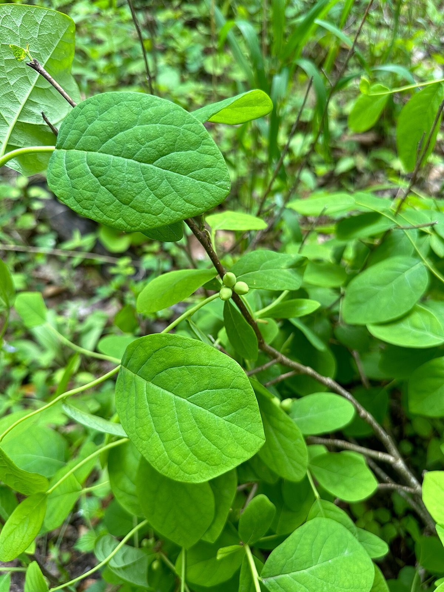

# Leatherwood

*Dirca palustris*

Dirca palustris, or eastern leatherwood, is a flowering shrub in the family Thymelaeceae native to eastern North America. The name leatherwood refers to the toughness of its elastic and fibrous bark, which was used to make cordage by Native American tribes, and later, European settlers. Other common names include leatherbark, wicopee (or wicopy), rope-bark, moosewood, and bois de plomb in Canada.

## Quick Facts

| | |
|---|---|
| **Scientific name** | *Dirca palustris* |
| **Family** | — |
| **Height** | — |
| **Bloom time** | — |
| **Sun** | — |
| **Moisture** | — |
| **Soil** | — |
| **Wildlife value** | — |

## Mentioned In

- [Woodland Forest Plants](../chapters/04-woodland-forest-plants/index.md)

## Image Credits

- Fritzflohrreynolds (CC BY-SA 3.0)
- Peter Quakenbush (CC BY 4.0)

## Learn More

- [Wikipedia: Dirca palustris](https://en.wikipedia.org/wiki/Dirca_palustris)
