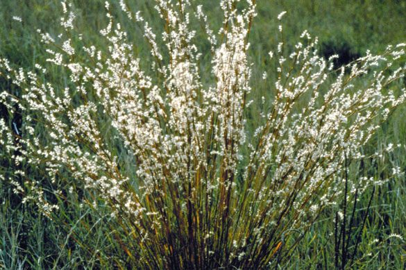
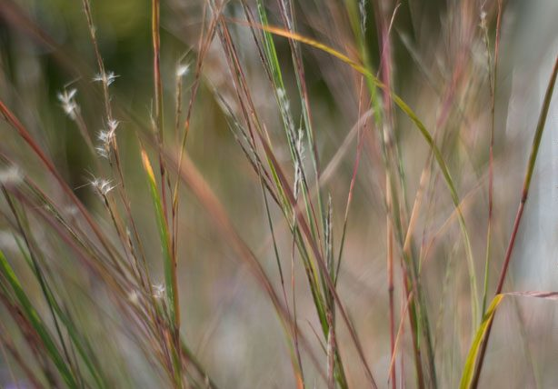

# Little Bluestem

*Schizachyrium scoparium*

Schizachyrium scoparium, commonly known as little bluestem or beard grass, is a species of North American prairie grass native to most of the contiguous United States (except California, Nevada, and Oregon) as well as a small area north of the Canada–US border and northern Mexico. It is most common in the Midwestern prairies and is one of the most abundant native plants in Texas grasslands.
Little bluestem is a perennial bunchgrass and is prominent in tallgrass prairies, along with big bluestem (Andropogon gerardi), indiangrass (Sorghastrum nutans) and switchgrass (Panicum virgatum).

## Quick Facts

| | |
|---|---|
| **Scientific name** | *Schizachyrium scoparium* |
| **Family** | — |
| **Height** | — |
| **Bloom time** | — |
| **Sun** | — |
| **Moisture** | — |
| **Soil** | — |
| **Wildlife value** | — |

## Mentioned In

- [Prairie Plants Grasslands](../chapters/03-prairie-plants-grasslands/index.md)

## Image Credits

- Unknown (Public domain)
- Alexschott (CC BY-SA 3.0)

## Learn More

- [Wikipedia: Schizachyrium scoparium](https://en.wikipedia.org/wiki/Schizachyrium_scoparium)
