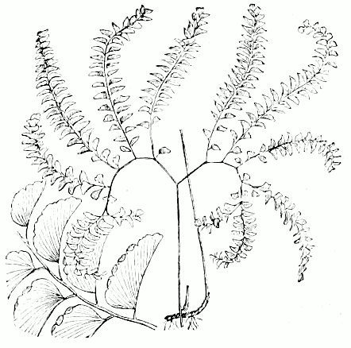
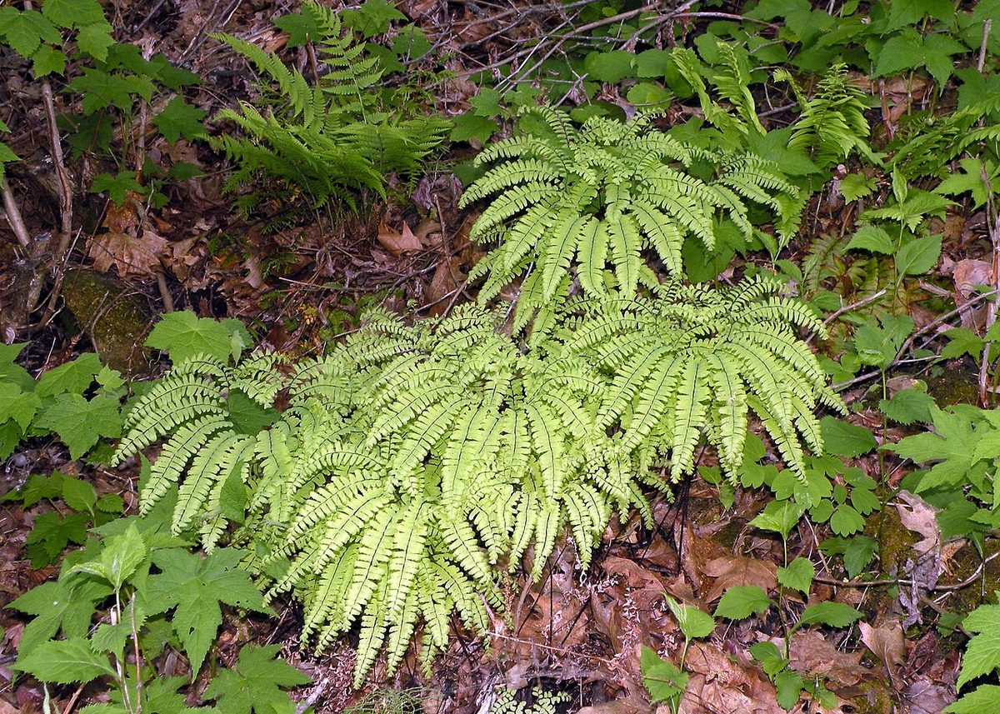

# Maidenhair Fern

*Adiantum pedatum*

Adiantum pedatum, the northern maidenhair fern, is a species of fern in the family Pteridaceae, native to moist forests in eastern North America. Like other ferns in the genus, the name maidenhair refers to the slender, shining black stipes. Taxonomy classification disputes occur due to the distribution of A. Pedatum in both North America and East Asia.

## Quick Facts

| | |
|---|---|
| **Scientific name** | *Adiantum pedatum* |
| **Family** | — |
| **Height** | — |
| **Bloom time** | — |
| **Sun** | — |
| **Moisture** | — |
| **Soil** | — |
| **Wildlife value** | — |

## Mentioned In

- [Woodland Forest Plants](../chapters/04-woodland-forest-plants/index.md)

## Image Credits

- Udo Dammer, see http://de.wikipedia.org/wiki/Carl_Lebrecht_Udo_Dammer (Public domain)
- Doug McGrady from Warwick, RI, USA (CC BY 2.0)

## Learn More

- [Wikipedia: Adiantum pedatum](https://en.wikipedia.org/wiki/Adiantum_pedatum)
