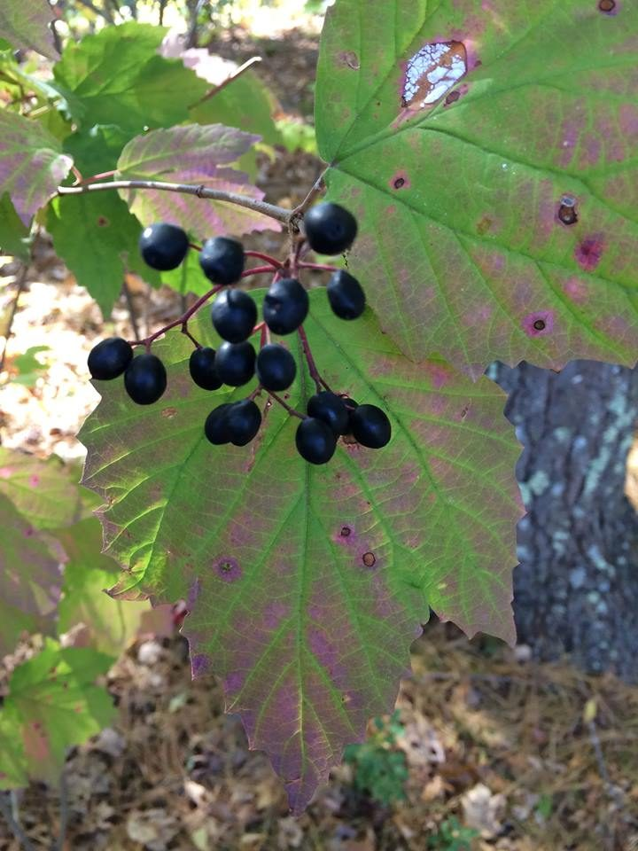

# Maple-leaved Viburnum

*Viburnum acerifolium*

Viburnum acerifolium, the mapleleaf viburnum, maple-leaved arrowwood or dockmackie, is a species of Viburnum native to eastern North America.

## Quick Facts

| | |
|---|---|
| **Scientific name** | *Viburnum acerifolium* |
| **Family** | — |
| **Height** | — |
| **Bloom time** | — |
| **Sun** | — |
| **Moisture** | — |
| **Soil** | — |
| **Wildlife value** | — |

## Mentioned In

- [Woodland Forest Plants](../chapters/04-woodland-forest-plants/index.md)

## Image Credits

- U. S. Department of Agriculture (Public domain)
- Joseph stewart (CC BY-SA 3.0)

## Learn More

- [Wikipedia: Viburnum acerifolium](https://en.wikipedia.org/wiki/Viburnum_acerifolium)
