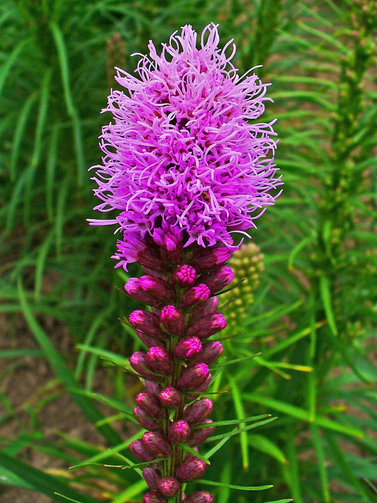

# Marsh Blazing Star

*Liatris spicata*

Liatris spicata, the dense blazing star, prairie feather, gayfeather or button snakewort, is a herbaceous perennial flowering plant in the family Asteraceae. It is native to eastern North America where it grows in moist prairies and meadows.
The plants have tall spikes of purple flowers resembling bottle brushes or feathers that grow 1–5 ft (0.30–1.52 m) tall.

## Quick Facts

| | |
|---|---|
| **Scientific name** | *Liatris spicata* |
| **Family** | — |
| **Height** | — |
| **Bloom time** | — |
| **Sun** | — |
| **Moisture** | — |
| **Soil** | — |
| **Wildlife value** | — |

## Mentioned In

- [Prairie Plants Grasslands](../chapters/03-prairie-plants-grasslands/index.md)

## Image Credits

- H. Zell (CC BY-SA 3.0)
- H. Zell (CC BY-SA 3.0)

## Learn More

- [Wikipedia: Liatris spicata](https://en.wikipedia.org/wiki/Liatris_spicata)
