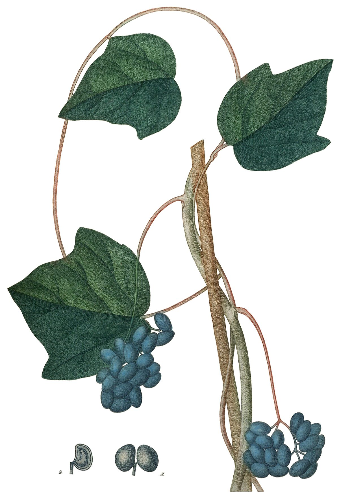

# Moonseed

*Menispermum canadense*

Menispermum canadense, the Canadian moonseed, common moonseed, or yellow parilla, is a species of flowering plant in the family Menispermaceae, native to eastern North America, from southern Canada south to northern Florida, and from the Atlantic coast west to Manitoba and Texas. It occurs in thickets, moist woods, and the banks of streams.

## Quick Facts

| | |
|---|---|
| **Scientific name** | *Menispermum canadense* |
| **Family** | — |
| **Height** | — |
| **Bloom time** | — |
| **Sun** | — |
| **Moisture** | — |
| **Soil** | — |
| **Wildlife value** | — |

## Mentioned In

- [Woodland Forest Plants](../chapters/04-woodland-forest-plants/index.md)

## Image Credits

- Cbaile19 (CC0)
- Jaume Saint-Hilaire, Jean Henri,1772-1845. (Public domain)

## Learn More

- [Wikipedia: Menispermum canadense](https://en.wikipedia.org/wiki/Menispermum_canadense)
